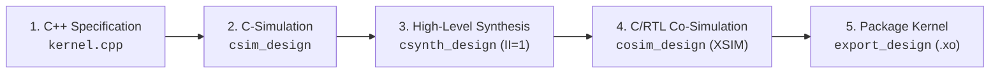

# 🚀 AMD Vitis HLS Custom Block Accelerator Database & Code Base

[](https://www.xilinx.com/products/silicon-devices/acap/versal-ai-edge.html)
[](https://www.xilinx.com/products/design-tools/vitis/vitis-hls.html)
[](https://github.com/Xilinx/Vitis-AI)
[]()
[](LICENSE)

> A production-grade hardware accelerator database and modular C++ High-Level Synthesis (HLS) code base. Designed to store, retrieve, and customise synthesizable hardware kernels for Large Language Models (LLMs), Vision Transformers (ViT) and  Physical AI Vision-Language-Action (VLA) model.
>
> This repository provides hardware-verified C++ HLS implementations running directly inside the Programmable Logic (PL) of the **AMD Versal AI Edge Gen 2 VEK385 (`xc2ve3858`)** achieving deterministic **Initiation Interval $II = 1$** throughput.

---

## 🧩 1. Hardware Accelerator & Custom Block Catalogue

| Kernel Operator                     | Target Model Domain           | Architectural Strategy & Hardware Pragmas                                         |  Interface & Pipeline  |                   Status & Deliverables                    | Target Silicon  |
| :---------------------------------- | :---------------------------- | :-------------------------------------------------------------------------------- | :--------------------: | :--------------------------------------------------------: | :-------------: |
| **Multi-Head Attention (MHA)**      | LLM / ViT / Transformer       | Fused QKV projections, streaming scaled dot-product score matrix & causal masking | AXI4-Stream / $II = 1$ |              **Implemented & To Be Verified**              |     VEK385      |
| **Matrix Multiplication (MatMul)**  | LLM / Transformer Dense       | Systolic array MAC processing elements with AXI4-Stream line buffers              | AXI4-Stream / $II = 1$ |              **Implemented & To Be Verified**              |     VEK385      |
| **LayerNorm**                       | Transformer Encoder / Decoder | Two-pass mean & variance reduction with cyclic BRAM partitioning                  | AXI4-Stream / $II = 1$ |              **Implemented & To Be Verified**              |     VEK385      |
| **GELU**                            | LLM / ViT / Physical AI       | Piecewise polynomial & hyperbolic tangent LUT approximation                       | AXI4-Stream / $II = 1$ |              **Implemented & To Be Verified**              |     VEK385      |
| **Discrete Cosine Transform (DCT)** | Signal & Image Pre-processing | Separable 2D matrix transposition ($8 \times 8$) with ping-pong buffering         | AXI4-Stream / $II = 1$ | **Hardware Closed** (`dct.xo` generated @ $343\text{MHz}$) | VCK190 / VEK385 |
| **Memory Map to Stream (MM2S)**     | Data Transfer & DMA           | Read data from FPGA DDR memory to AXI4-Stream                                     | AXI4-Stream / $II = 1$ |              **Implemented & To Be Verified**              |     VEK385      |
| **Stream to Memory Map (S2MM)**     | Data Transfer & DMA           | Write data from AXI4-Stream back to FPGA DDR memory                               | AXI4-Stream / $II = 1$ |              **Implemented & To Be Verified**              |     VEK385      |


---

## 📁 2. Repository Architecture & Directory Structure

```text
HLS_custom_block_guide_yusep2026/
├── src/                        # Synthesizable C++ HLS acceleration kernels
│   ├── common/                 # Shared data types, fixed-point ap_fixed definitions, and types.h
│   │   ├── hls_common.hpp
│   │   └── types.h
│   ├── dct/                    # 2D 8x8 Discrete Cosine Transform kernel and testbench
│   ├── GELU/                   # GELU non-linear activation kernel and testbench
│   ├── layernorm/              # LayerNorm statistical reduction kernel and testbench
│   ├── mha_kernel/             # Quantized Multi-Head Attention kernel and testbench
│   ├── softmax/                # Row-wise Softmax activation kernel and testbench
│   └── tiled_matmul/           # Output-stationary tiled matrix multiplication kernel and testbench
├── tests/                      # Algorithmic golden models and regression testbenches
│   ├── test_basic.py           # Module structure and file completeness assertions
│   └── test_gelu_embed.py      # Algorithmic golden verification for GELU embedding
├── xo/                         # Packaged Xilinx Object (.xo) hardware containers for v++
├── ip/                         # Generated Vivado IP Catalog blocks for block designs
├── rtl/                        # Post-synthesis cycle-accurate Verilog/VHDL RTL
├── docs/                       # Comprehensive architectural guides and tutorials
│   ├── hls_blocks/             # Detailed engineering specifications for each custom block
│   ├── vitis_setup/            # Vitis Unified IDE and Linux configuration SOP
│   └── hls_tutorial/           # Step-by-Step Vitis HLS Design Flow & Timing Guide
├── platforms/                  # Base extensible platform definitions (.xsa)
├── config/                     # Configuration templates (hls_config.cfg, system.cfg)
├── scripts/                    # Automated build orchestrators (batch synthesis, autoscript.py)
├── .gitignore                  # Build artifact exclusions
├── LICENSE                     # Apache 2.0 Open Source Licence
└── README.md                   # Master engineering documentation
```

---

## 🛠️ 3. Toolchains & Target Environment

* **Target Silicon:**
  * **Primary:** AMD Versal AI Edge Gen 2 VEK385 (`xc2ve3858-ssva2112-2MP-e-S`)
  * **Secondary / Reference:** AMD Versal AI Core VCK190 (`xcvc1902`) 
* **HLS & Synthesis Toolchains:**
  * AMD Vitis Unified IDE / Vitis HLS (v2024.1 – v2026.1+)
  * AMD Vivado Design Suite & Vivado XSIM RTL Simulator
  * AMD `v++` Compiler / System Linker
* **AI & Compiler Frameworks:**
  * AMD Vitis AI v6.2 (NPU AIE-ML graph partitioning & ONNX Opset 20/21/22 support)
* **Host & Verification Environment:**
  * Ubuntu 22.04 LTS or Windows 11 Host
  * Python 3.10+ (NumPy, SciPy, standard unittest framework)

---

## ⚡ 4. Quick Start: 5-Stage HLS Lifecycle

Follow the AMD Vitis HLS engineering lifecycle from algorithmic specification to hardware container packaging:



### Stage 1: Functional C-Simulation
Run algorithmic golden assertions and functional C-simulation:
```bash
# Run native Vitis HLS C-Simulation via CLI
vitis-run --mode hls --config config/hls_config.cfg --work_dir build/hls_block_sim --csim
```

### Stage 2: High-Level Synthesis (C-Synthesis)
Synthesise C++ source to cycle-accurate RTL targeting $II = 1$:
```bash
vitis-run --mode hls --config config/hls_config.cfg --work_dir build/hls_block_syn --syn
```

### Stage 3: C/RTL Co-Simulation
Verify cycle-accurate RTL behaviour against golden test vectors:
```bash
vitis-run --mode hls --config config/hls_config.cfg --work_dir build/hls_block_cosim --cosim
```

### Stage 4: Package Deployable Hardware Object (`.xo`)
Export synthesised block as a reusable `.xo` container for `v++` system linking:
```bash
vitis-run.bat --mode hls --config config/hls_config.cfg --work_dir build/hls_block_export --package
```

---

## 🧪 5. Automated Verification Suite

Run regression tests across all custom kernel modules (Under Development):

```bash
python -m unittest discover -s tests -p "test_*.py" -v
```

---

## 📜 6. Development Status & Roadmap

*This repository is under active engineering authoring within the China Telecom Singapore Innovation and Research Institute (CTSIRI) AI-on-FPGA research programme.*

### 🎯 Strategic Engineering Roadmap

1. **🧩 Database Expansion (Custom C++ HLS Blocks):**
   * Author and ingest additional non-GEMM and non-linear hardware acceleration blocks into the database, expanding coverage across LLMs, ViTs, and Physical AI.

2. **🔍 Code Review & Refactoring:**
   * Systematically audit and refine existing C++ kernel implementations, ensuring strict AXI4-Stream interface compliance, fixed-point precision tuning (`ap_fixed`), and deterministic $II = 1$ pipeline closure.

3. **📊 Status & Deliverable Completion:**
   * Execute full physical implementation across all catalogue items, documenting post-route clock frequencies, timing slack ($WNS \ge 0$), and resource utilisation footprints (LUTs, FFs, DSP58s, BRAMs), while packaging verified `.xo` hardware containers.

4. **⚙️ Automated C++ Code & Testbench Generation:**
   * Develop a parameterised template engine (e.g., Python generator) to automatically emit synthesizable C++ kernels and self-checking testbenches from model configuration profiles, enabling headless/online C-Simulation (`csim`) execution.

5. **🧪 Automated Verification Suite:**
   * Build a comprehensive, multi-tiered automated verification suite bridging Python golden algorithmic references, cycle-accurate RTL Co-Simulation (Vivado XSIM), and automated regression test runners.

---
* **Author & GitHub Repo Owner:** Yuan Fangxing | CTSIRI Hardware Acceleration Engineering

