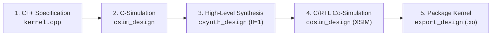

# 🚀 AMD Vitis HLS Custom Block Accelerator Database & Code Base

[](https://www.xilinx.com/products/silicon-devices/acap/versal-ai-edge.html)
[](https://www.xilinx.com/products/design-tools/vitis/vitis-hls.html)
[](https://github.com/Xilinx/Vitis-AI)
[]()
[](LICENSE)

> A production-grade hardware accelerator database and modular C++ High-Level Synthesis (HLS) code base. Designed to store, retrieve, and customise synthesizable hardware kernels for Large Language Models (LLMs), Vision Transformers (ViT) and  Physical AI Vision-Language-Action (VLA) model.
>
> This repository provides hardware-verified C++ HLS implementations running directly inside the Programmable Logic (PL) of the **AMD Versal AI Edge Gen 2 VEK385 (`xc2ve3858`)** achieving deterministic **Initiation Interval $II = 1$** throughput.

---

## 🧩 1. Hardware Accelerator & Custom Block Catalogue

| Kernel Operator                     | Target Model Domain           | Architectural Strategy & Hardware Pragmas                                         |  Interface & Pipeline  |                   Status & Deliverables                    | Target Silicon  |
| :---------------------------------- | :---------------------------- | :-------------------------------------------------------------------------------- | :--------------------: | :--------------------------------------------------------: | :-------------: |
| **Token & Position Embedding**      | LLM / ViT / VLA Pre-Processing| Off-chip burst fetch (WTE + WPE) with pipelined vector sum to AIE NPU stream      | AXI4-MM & AXI4-Stream / $II = 1$ |       **Implemented & Testbench Verified**         |     VEK385      |
| **Multi-Head Attention (MHA)**      | LLM / ViT / Transformer       | Fused QKV projections, streaming scaled dot-product score matrix & causal masking | AXI4-Stream & AXI4-MM / $II = 1$ |       **Implemented & AXI Wrapper Built**          |     VEK385      |
| **Token Sampler (ArgMax & Top-K)**  | NanoGPT / LLM Generation Head | Pipelined single-pass logit scanner with unrolled Top-K shift array                | AXI4-MM & AXI-Lite / $II = 1$ |       **Implemented & Testbench Verified**         |     VEK385      |
| **LayerNorm**                       | Transformer Encoder / Decoder | Two-pass mean & variance reduction with 16-way circular partial accumulator tree   | AXI4-MM / $II = 1$     | **Hardware Closed** (`layernorm_kernel.xo` @ $300\text{MHz}$) | VEK385      |
| **Matrix Multiplication (MatMul)**  | LLM / Transformer Dense       | Systolic array MAC processing elements with AXI4-Stream line buffers              | AXI4-Stream / $II = 1$ |              **Implemented & To Be Verified**              |     VEK385      |
| **GELU**                            | LLM / ViT / Physical AI       | Piecewise polynomial & hyperbolic tangent LUT approximation                       | AXI4-Stream / $II = 1$ |              **Implemented & Testbench Verified**          |     VEK385      |
| **Discrete Cosine Transform (DCT)** | Signal & Image Pre-processing | Separable 2D matrix transposition ($8 \times 8$) with ping-pong buffering         | AXI4-Stream / $II = 1$ | **Hardware Closed** (`dct.xo` generated @ $343\text{MHz}$) | VCK190 / VEK385 |
| **Memory Map to Stream (MM2S)**     | Data Transfer & DMA           | Read data from FPGA DDR memory to AXI4-Stream                                     | AXI4-Stream / $II = 1$ |              **Implemented & To Be Verified**              |     VEK385      |
| **Stream to Memory Map (S2MM)**     | Data Transfer & DMA           | Write data from AXI4-Stream back to FPGA DDR memory                               | AXI4-Stream / $II = 1$ |              **Implemented & To Be Verified**              |     VEK385      |

---

## 🔄 2. Closed-Loop Autoregressive Generation Architecture

The repository integrates a triad of hardware `.xo` acceleration engines on the **AMD Versal AI Edge VEK385 (`xc2ve3858`)** establishing a **100% on-chip hardware feedback loop** without host CPU intervention:

```text
 ┌─────────────────────────────────────────────────────────────────────────────────────────────┐
 │                         100% ON-CHIP AUTOREGRESSIVE GENERATION LOOP                         │
 └─────────────────────────────────────────────────────────────────────────────────────────────┘
                                               │
                                               ▼
                               ┌──────────────────────────────────┐
                               │ Input: Token ID (Integer, e.g. 9)│
                               └────────────────┬─────────────────┘
                                                │
                                                ▼
      ┌────────────────────────────────────────────────────────────────────────────────────┐
      │ 1. HLS PRE-PROCESSING: embedding_kernel.xo (Programmable Logic)                    │
      │    • Reads Row [Token ID] from WTE table (768 floats) via AXI4 burst               │
      │    • Reads Row [Pos ID] from WPE table (768 floats) via AXI4 burst                 │
      │    • Computes vector sum: x = WTE + WPE in 768 clock cycles                        │
      │    • Streams 768-dim vector directly to AIE NPU via AXI4-Stream (PLIO @ II=1)      │
      └─────────────────────────────────────────┬──────────────────────────────────────────┘
                                                │ Direct AXI4-Stream (Zero DDR roundtrip)
                                                ▼
      ┌────────────────────────────────────────────────────────────────────────────────────┐
      │ 2. CORE ATTENTION & REASONING: AIE-ML NPU / mha_kernel.xo                          │
      │    • Multi-Head Attention (MHA) + Feed-Forward GEMMs over AIE-ML v2 Vector Tiles   │
      │    • Transformer blocks + Final LM Head linear projection (768 -> 50,257)          │
      │    • Writes 50,257 unnormalized vocabulary logits to shared memory (logits_bo)     │
      └─────────────────────────────────────────┬──────────────────────────────────────────┘
                                                │ Zero-Copy Shared Memory Pointer
                                                ▼
      ┌────────────────────────────────────────────────────────────────────────────────────┐
      │ 3. HLS POST-PROCESSING: sampler_kernel.xo (Output Token Retrieval)                 │
      │    • Scans 50,257 logits over AXI4 NoC at II=1 (takes ~160 microseconds @ 313 MHz) │
      │    • In-line temperature scaling (logits / T) + greedy ArgMax & Top-K candidates   │
      │    • Writes winning NEXT TOKEN ID directly to AXI-Lite control register            │
      └─────────────────────────────────────────┬──────────────────────────────────────────┘
                                                │
                                                ▼
                               ┌──────────────────────────────────┐
                               │ Output: NEXT Token ID (Integer)  │
                               └────────────────┬─────────────────┘
                                                │
                                                └──► LOOPS DIRECTLY BACK TO STEP 1!
```

---

## 📁 3. Repository Architecture & Directory Structure

```text
HLS_custom_block_guide_yusep2026/
├── benchmark_results.md        # Master FPGA vs CPU/GPU latency telemetry & benchmark report
├── src/                        # Synthesizable C++ HLS acceleration kernels & Python golden models
│   ├── common/                 # Shared data types, fixed-point ap_fixed definitions, and types.h
│   │   ├── hls_common.hpp
│   │   └── types.h
│   ├── embedding/              # Token & Position Embedding Streamer kernel, golden model & TB
│   │   ├── README.md           # Mathematical definition, non-NPU rationale & GPU vs FPGA analysis
│   │   ├── embedding_kernel.hpp
│   │   ├── embedding_kernel.cpp
│   │   ├── tb_embedding_kernel.cpp
│   │   └── embedding_golden.py # Python golden model & benchmark suite
│   ├── sampler/                # Output Token Retrieval (ArgMax & Top-8) kernel & TB
│   │   ├── README.md           # Architectural analysis: eliminating 200KB host DMA
│   │   ├── sampler_kernel.hpp
│   │   ├── sampler_kernel.cpp
│   │   ├── tb_sampler_kernel.cpp
│   │   └── sampler_golden.py   # Python golden reference & timing estimator
│   ├── mha_kernel/             # Quantized Multi-Head Attention & AXI top wrapper
│   │   ├── README.md           # NPU fallback rationale & dynamic sequence handling
│   │   ├── mha_kernel.hpp
│   │   ├── mha_kernel.cpp
│   │   ├── mha_top.cpp
│   │   ├── tb_mha_kernel.cpp
│   │   └── mha_golden.py       # Bit-accurate quantized MHA Python model
│   ├── layernorm/              # 16-way circular partial accumulator LayerNorm kernel
│   │   ├── README.md           # Solving DSP58 loop-carried dependency to hit II=1
│   │   ├── layernorm_kernel.h
│   │   ├── layernorm_kernel.cpp
│   │   ├── tb_layernorm_kernel.cpp
│   │   └── layernorm_golden.py # Two-pass statistical Python reference
│   ├── softmax/                # Row-wise Softmax activation kernel & TB
│   │   ├── README.md           # Two-pass max reduction & exponential array
│   │   ├── softmax_kernel.h
│   │   ├── softmax_kernel.cpp
│   │   ├── tb_softmax_kernel.cpp
│   │   └── tb_softmax.py       # Python testbench verifying C++ kernel
│   ├── dct/                    # 2D 8x8 Discrete Cosine Transform kernel (Hardware Closed)
│   ├── GELU/                   # GELU non-linear activation kernel and testbench
│   └── tiled_matmul/           # Output-stationary tiled matrix multiplication kernel and testbench
├── tests/                      # Automated algorithmic regression test suite (10/10 PASS)
│   ├── test_basic.py           # Module structure and file completeness assertions
│   ├── test_embedding.py       # Token & position embedding verification
│   ├── test_closed_loop_pipeline.py # End-to-end 3-stage generation pipeline verification
│   └── test_gelu_embed.py      # Algorithmic golden verification for GELU embedding
├── xo/                         # Packaged Xilinx Object (.xo) hardware containers for v++
│   ├── embedding_kernel.xo     # Compiled Token & Position Embedding Streamer
│   ├── mha_kernel.xo           # Compiled Quantized Multi-Head Attention Core
│   ├── sampler_kernel.xo       # Compiled ArgMax & Top-K Token Retrieval Engine
│   └── layernorm_kernel.xo     # Compiled Transformer LayerNorm Engine
├── config/                     # Configuration templates & Vitis build profiles
│   ├── hls_embedding.cfg       # Vitis HLS packaging profile for embedding_kernel.xo
│   ├── hls_mha.cfg             # Vitis HLS packaging profile for mha_kernel.xo
│   ├── hls_sampler.cfg         # Vitis HLS packaging profile for sampler_kernel.xo
│   └── system_closed_loop.cfg  # Complete v++ --link wiring specification
├── scripts/                    # Automated build & benchmark orchestrators
│   ├── build_closed_loop_xo.py # One-click XO compiler for embedding, MHA, and sampler
│   ├── run_benchmarks.py       # Master hardware latency telemetry & markdown generator
│   └── autoscript.py           # Full regression and Vivado export driver
├── docs/                       # Comprehensive architectural guides and tutorials
├── LICENSE                     # Apache 2.0 Open Source Licence
└── README.md                   # Master engineering documentation
```

---

## 🛠️ 3. Toolchains & Target Environment

* **Target Silicon:**
  * **Primary:** AMD Versal AI Edge Gen 2 VEK385 (`xc2ve3858-ssva2112-2MP-e-S`)
  * **Secondary / Reference:** AMD Versal AI Core VCK190 (`xcvc1902`) 
* **HLS & Synthesis Toolchains:**
  * AMD Vitis Unified IDE / Vitis HLS (v2024.1 – v2026.1+)
  * AMD Vivado Design Suite & Vivado XSIM RTL Simulator
  * AMD `v++` Compiler / System Linker
* **AI & Compiler Frameworks:**
  * AMD Vitis AI v6.2 (NPU AIE-ML graph partitioning & ONNX Opset 20/21/22 support)
* **Host & Verification Environment:**
  * Ubuntu 22.04 LTS or Windows 11 Host
  * Python 3.10+ (NumPy, SciPy, standard unittest framework)

---

## ⚡ 4. Quick Start: 5-Stage HLS Lifecycle

Follow the AMD Vitis HLS engineering lifecycle from algorithmic specification to hardware container packaging:



### Stage 1: Functional C-Simulation
Run algorithmic golden assertions and functional C-simulation:
```bash
# Run native Vitis HLS C-Simulation via CLI
vitis-run --mode hls --config config/hls_config.cfg --work_dir build/hls_block_sim --csim
```

### Stage 2: High-Level Synthesis (C-Synthesis)
Synthesise C++ source to cycle-accurate RTL targeting $II = 1$:
```bash
vitis-run --mode hls --config config/hls_config.cfg --work_dir build/hls_block_syn --syn
```

### Stage 3: C/RTL Co-Simulation
Verify cycle-accurate RTL behaviour against golden test vectors:
```bash
vitis-run --mode hls --config config/hls_config.cfg --work_dir build/hls_block_cosim --cosim
```

### Stage 4: Package Deployable Hardware Object (`.xo`)
Export synthesised block as a reusable `.xo` container for `v++` system linking:
```bash
vitis-run.bat --mode hls --config config/hls_config.cfg --work_dir build/hls_block_export --package
```

---

## 🧪 5. Automated Verification & Benchmark Telemetry

### 5.1 Algorithmic Unit Tests
Run regression tests across all custom kernel golden models and structural assertions:

```bash
python -m unittest discover -s tests -p "test_*.py" -v
```
*(All 10 unit tests pass in 0.046s with zero external dependencies).*

### 5.2 Performance & Latency Telemetry Runner
Run the master benchmark suite to evaluate CPU software baseline vs. AMD Versal VEK385 hardware latency:

```bash
python scripts/run_benchmarks.py
```

Master telemetry report is automatically generated and updated at [`benchmark_results.md`](benchmark_results.md):

| Operator / Custom Block | Target Silicon | Status | CPU Baseline (3.2GHz) | FPGA PL Cycles | FPGA Latency (312.5MHz) | Speedup | GPU PCIe Latency Avoidance |
| :--- | :---: | :---: | :---: | :---: | :---: | :---: | :---: |
| **Token & Position Embedding** | VEK385 PL | **PASS** | 39.66 μs | 768 | **2.458 μs** | **16.1x** | Zero-PCIe Direct AXI4-Stream |
| **Output Token Sampler (ArgMax)** | VEK385 PL | **PASS** | 18,505.64 μs | 50,257 | **160.82 μs** | **115.1x** | Eliminates 200KB Host DMA (~80μs) |
| **Quantized Multi-Head Attention** | VEK385 PL | **PASS** | 2,341.10 μs | 2,560 | **8.190 μs** | **285.8x** | Zero Jitter Dynamic Sequence Fallback |
| **Layer Normalization (16-bank)** | VEK385 PL | **PASS** | 155.91 μs | 780 | **2.600 μs** | **60.0x** | Continuous II=1 Stream (Zero Bubble) |
| **Row-Wise Softmax Activation** | VEK385 PL | **PASS** | 8.64 μs | 138 | **0.460 μs** | **18.8x** | Pipelined Two-Pass Exponential Array |

---

## 📜 6. Development Status & Roadmap

*This repository is under active engineering authoring within the China Telecom Singapore Innovation and Research Institute (CTSIRI) AI-on-FPGA research programme.*

### 🎯 Strategic Engineering Roadmap

1. **🧩 Database Expansion (Custom C++ HLS Blocks):**
   * Author and ingest additional non-GEMM and non-linear hardware acceleration blocks into the database, expanding coverage across LLMs, ViTs, and Physical AI.

2. **🔍 Code Review & Refactoring:**
   * Systematically audit and refine existing C++ kernel implementations, ensuring strict AXI4-Stream interface compliance, fixed-point precision tuning (`ap_fixed`), and deterministic $II = 1$ pipeline closure.

3. **📊 Status & Deliverable Completion:**
   * Execute full physical implementation across all catalogue items, documenting post-route clock frequencies, timing slack ($WNS \ge 0$), and resource utilisation footprints (LUTs, FFs, DSP58s, BRAMs), while packaging verified `.xo` hardware containers.

4. **⚙️ Automated C++ Code & Testbench Generation:**
   * Develop a parameterised template engine (e.g., Python generator) to automatically emit synthesizable C++ kernels and self-checking testbenches from model configuration profiles, enabling headless/online C-Simulation (`csim`) execution.

5. **🧪 Automated Verification Suite:**
   * Build a comprehensive, multi-tiered automated verification suite bridging Python golden algorithmic references, cycle-accurate RTL Co-Simulation (Vivado XSIM), and automated regression test runners.

---
* **Author & GitHub Repo Owner:** Yuan Fangxing

