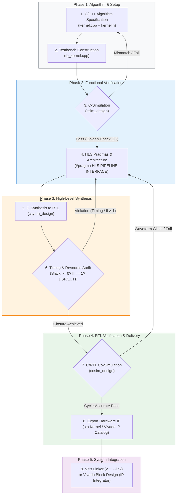

# 🚀 AMD Vitis HLS Custom Block Guide & Accelerator Flow (2026)

[](https://www.xilinx.com/products/design-tools/vitis/vitis-hls.html)
[](https://www.xilinx.com/products/silicon-devices/acap/versal-ai-edge.html)
[]()
[]()
[](LICENSE)
[]()

> **Project Authority:** CTSIRI AI-on-FPGA Engineering Lab & 6G AI-RAN Acceleration Group  
> **Repository:** [`yuan20170517/HLS_custom_block_guide_yusep2026`](https://github.com/yuan20170517/HLS_custom_block_guide_yusep2026)  
> **Target Silicon:** AMD Versal AI Edge Gen 2 VEK385 (`xc2ve3858-ssva2112-2MP-e-S`)  
> **Master SOP Guide:** [`docs/hls_tutorial/HLS_Step_by_Step_Tutorial_and_Flowchart.md`](docs/hls_tutorial/HLS_Step_by_Step_Tutorial_and_Flowchart.md)

---

## 📑 Table of Contents
- [1. Engineering Rationale & Strategic Objective](#-1-engineering-rationale--strategic-objective)
- [2. End-to-End Vitis HLS Design Flowchart](#-2-end-to-end-vitis-hls-design-flowchart)
- [3. Custom Hardware Operator Catalogue](#-3-custom-hardware-operator-catalogue)
- [4. Repository Directory Structure](#-4-repository-directory-structure)
- [5. Step-by-Step Implementation & Toolflow Guide (Steps 0 – 4)](#-5-step-by-step-implementation--toolflow-guide-steps-0--4)
- [6. Real-World Engineering Debugging Playbook](#-6-real-world-engineering-debugging-playbook)
- [7. Documentation, Test Suite & Citation](#-7-documentation-test-suite--citation)

---

## 🎯 1. Engineering Rationale & Strategic Objective

Standard deep learning co-processors (e.g. AMD Vitis AI / DPU) are heavily optimised for dense GEMM matrix multiplications and 2D convolutions, but **lack native silicon support for critical Transformer non-linearities and emerging Physical AI operators**:
* **LayerNorm / RMSNorm:** Requiring multi-stage statistical reduction and normalisation.
* **Causal & Row-wise Softmax:** Involving online exponential accumulation and dynamic scaling.
* **Non-linear Activations (GELU, SwiGLU):** Requiring piecewise polynomial or hyperbolic tangent approximation.

Executing these non-GEMM operators on a host CPU over PCIe/AXI introduces unacceptable latency ($>50\,\mu\text{s}$), violating real-time wireless deadlines in 6G AI-RAN. **HLS_custom_block_guide_yusep2026** provides a production-grade blueprint to design, verify, synthesise, and package custom C++ HLS accelerator blocks running directly inside the Programmable Logic (PL) of the **AMD Versal AI Edge Gen 2 VEK385 platform**, achieving deterministic **`II = 1`** throughput at $>300\,\text{MHz}$.

---

## 📊 2. End-to-End Vitis HLS Design Flowchart

Following the standard AMD Vitis HLS design methodology:



---

## 🧩 3. Custom Hardware Operator Catalogue

| Operator | Kernel Source | Architectural Strategy & Hardware Pragmas | Status & II | Target Silicon |
| :--- | :--- | :--- | :---: | :---: |
| **LayerNorm** | [`src/hls/layernorm/`](src/hls/layernorm/) | 16-way Round-Robin Partial Accumulators (`NACC=16`) + cyclic BRAM partitioning | **`II = 1` (Verified)** | AMD Versal AI Edge Gen 2 VEK385 |
| **Softmax** | [`src/hls/softmax/`](src/hls/softmax/) | Online numerical max search + streaming exponential accumulation | **TBC** | AMD Versal AI Edge Gen 2 VEK385 |
| **GELU** | [`src/hls/gelu/`](src/hls/gelu/) | Hardware polynomial approximation | **TBC** | AMD Versal AI Edge Gen 2 VEK385 |
| **RMSNorm** | [`case/`](case/) | Pipelined DSP58 MACs + reciprocal square-root approximation | **TBC** | AMD Versal AI Edge Gen 2 VEK385 |
| **2D DCT** | [`docs/hls_tutorial/`](docs/hls_tutorial/) | Cascaded 1D row/column transforms with ping-pong transposition buffers | **TBC** | AMD Versal AI Edge Gen 2 VEK385 |
| **RoPE** | [`docs/hls_tutorial/`](docs/hls_tutorial/) | Dual-channel complex rotators with on-chip phase BRAM LUT | **TBC** | AMD Versal AI Edge Gen 2 VEK385 |

---

## 📁 4. Repository Directory Structure

```text
HLS_custom_block_guide_yusep2026/
├── .github/
│   └── workflows/
│       └── ci.yml               # Automated GitHub Actions CI test suite
├── case/                        # Parametric C++ templates for code generation
│   ├── layernorm.cpp.template   # LayerNorm template (substitutes embed_dim, NACC)
│   ├── softmax.cpp.template     # Softmax template (TBC)
│   └── gelu.cpp.template        # GELU polynomial activation template (TBC)
├── statistics/                  # Model shape & quantization statistics profiles
│   ├── vit_base_config.json     # Standard ViT-B/16 configuration (D=768, N=197)
│   └── nanogpt_config.json      # Transformer configuration (D=384, N=1024)
├── src/                         # Synthesizable C++ HLS accelerator kernels
│   ├── hls/
│   │   ├── common/types.h       # Fixed-point definitions (ap_fixed<16,6>) & macros
│   │   ├── layernorm/           # LayerNorm C++ kernel implementation & header
│   │   ├── softmax/             # Softmax C++ kernel implementation & header (TBC)
│   │   ├── gelu/                # GELU C++ kernel implementation & header (TBC)
│   │   └── instances/           # Generated C++ instances ready for synthesis
│   ├── main.py                  # Environment inspection module
│   └── time_utils.py            # Utility timestamp helper
├── scripts/                     # Automated 4-step workflow orchestrators
│   ├── step0_case_generation.py # Populates C++ templates from statistics JSON
│   ├── step1_hls_build.py       # Automated Vitis HLS compilation & csynth runner
│   ├── step2_cosim_verify.py    # Cycle-accurate Co-Sim testbench validator
│   └── step3_export_vivado.py   # Packages .xo containers & system linking config
├── docs/                        # Comprehensive guides, tutorials, and waveforms
│   ├── Test note added 7 Sep 2026.md
│   └── hls_tutorial/            # Step-by-Step Vitis HLS Tutorial & Flowchart
│       ├── assets/              # Hardware waveforms & execution evidence (8 PNGs)
│       └── HLS_Step_by_Step_Tutorial_and_Flowchart.md
├── tests/                       # Automated Python test suite & golden models
│   ├── test_basic.py            # Basic repository environment validation
│   ├── test_current_time.py     # Timestamp utility validation
│   ├── test_layernorm.py        # LayerNorm golden comparison (tolerance < 1e-4)
│   ├── test_softmax.py          # Softmax mathematical validation
│   ├── test_gelu.py             # GELU polynomial boundary & value verification
│   └── test_step0_codegen.py    # Parametric C++ code-generation validator
├── .gitignore                   # Clean exclusions for Vitis/Vivado temporary files
├── LICENSE                      # Apache 2.0 Open Source Licence
└── README.md                    # Repository master documentation
```

---

## 🛠️ 5. Step-by-Step Implementation & Toolflow Guide (Steps 0 – 4)

This workflow directly mirrors **Section 3 (Step-by-Step Implementation Guide)** of the master SOP:

```
[statistics/*.json] + [case/*.template]
                  │
                  ▼  (Step 0: Parametric Case Generation)
        [src/hls/instances/*.cpp]
                  │
                  ▼  (Step 1: Testbench & C-Simulation)
        [Functional Algorithmic Verification PASS]
                  │
                  ▼  (Step 2: Vitis HLS C-Synthesis)
        [Verilog RTL Synthesis & II=1 Closure]
                  │
                  ▼  (Step 3: Cycle-Accurate Co-Simulation)
        [Vivado XSIM Cycle-Accurate PASS]
                  │
                  ▼  (Step 4: IP Packaging & System Linking)
        [Extensible Kernel Object (.xo) + system.cfg]
```

### 🔹 Step 0: Project Setup & Hardware Configuration

Configure hardware device target (`xc2ve3858-ssva2112-2MP-e-S`), baseline clock ($T_{clk}=8.0\,\text{ns}$ / $3.33\,\text{ns}$), and inject tensor dimensions into parametric templates:
```bash
# AMD Vitis HLS Component Configuration (Versal AI Edge Gen 2)
part=xc2ve3858-ssva2112-2MP-e-S

[hls]
package.output.format=xo
package.output.syn=false
syn.top=dct
syn.file=C:////Vitis_HLS_tutorial/dct.cpp
tb.file=C:////Vitis_HLS_tutorial/dct_test.cpp
tb.file=C:///Vitis_HLS_tutorial/in.dat
tb.file=C:///Vitis_HLS_tutorial/out.golden.dat
clock=8ns
clock_uncertainty=12%
csim.clean=1
syn.compile.pipeline_loops=5
cosim.rtl=verilog
```
* **Output:** Synthesizable C++ instances generated in `src/hls/instances/` (`layernorm_kernel_gen.cpp`).

### 🔹 Step 1: Testbench Construction & Algorithmic C-Simulation
*(Aligned with SOP Step 2 & 3: Kernel Architecture & C-Simulation)*  
Verify functional algorithmic correctness against NumPy/IEEE-754 golden references prior to RTL synthesis:
```bash
python -m unittest discover -s tests -p "test_*.py" -v
```
* **Assertion:** Numerical tolerance strictly bounded ($Tolerance < 10^{-4}$).

### 🔹 Step 2: High-Level Synthesis (C-Synthesis) & Performance Audit
*(Aligned with SOP Step 4: High-Level Synthesis & Latency Audit)*  
Synthesise C++ algorithmic logic into Verilog RTL targeting the **AMD Versal AI Edge Gen 2 VEK385**:
```bash
python scripts/step1_hls_build.py --kernel layernorm --part xc2ve3858-ssva2112-2MP-e-S
```
* **Optimization Directives:** `#pragma HLS PIPELINE II=1` and 16-way Round-Robin Partial Accumulators (`NACC=16`) to break DSP58 adder feedback loops.

### 🔹 Step 3: Cycle-Accurate C/RTL Co-Simulation
*(Aligned with SOP Step 5: Cycle-Accurate C/RTL Co-Simulation)*  
Validate hardware handshake signalling (`ap_start`, `ap_done`, `ap_ready`) in Vivado Simulator (`xsim`):
```bash
python scripts/step2_cosim_verify.py --kernel layernorm
```
* **Result:** Cycle-accurate timing validated with zero deadlocks or protocol violations.

### 🔹 Step 4: Physical Implementation & Vivado Linker Packaging
*(Aligned with SOP Step 6 & 7: IP Packaging & System Integration)*  
Package synthesised RTL into an AMD Extensible Object (`.xo`) and generate platform Network-on-Chip (NoC) connectivity (`system.cfg`):
```bash
python scripts/step3_export_vivado.py
v++ --link --target hw --platform xilinx_vek385_base_202610_1 --config system.cfg *.xo -o vitis_accel.xclbin
```

---

### Citation
```bibtex
@misc{ctsiri_hls_custom_block_2026,
  author = {Yuan, Fangxing},
  title = {AMD Vitis HLS Custom Block Guide & Hardware Acceleration Repository (Versal AI Edge VEK385)},
  year = {2026},
  publisher = {GitHub},
  howpublished = {\url{https://github.com/yuan20170517/HLS_custom_block_guide_yusep2026}}
}
```

*Maintained by Yuan Fangxing | CTSIRI AI-RAN & Hardware Acceleration Engineering.*