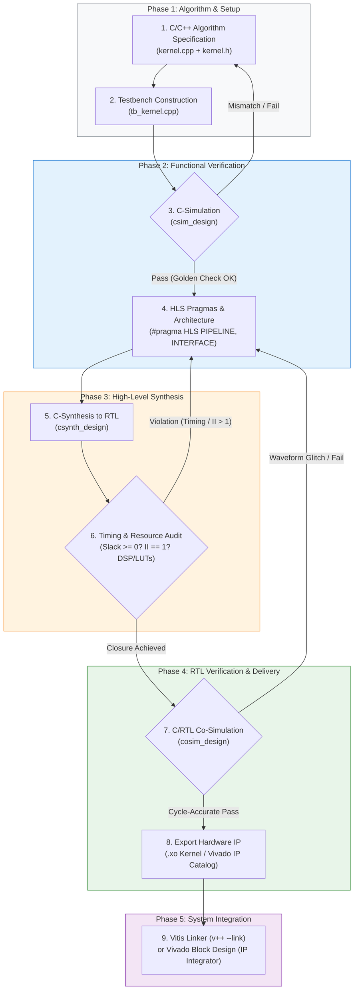

# 🚀 AMD Vitis HLS Custom Block Guide & Accelerator Flow (2026)

[](https://www.xilinx.com/products/design-tools/vitis/vitis-hls.html)
[](https://www.xilinx.com/products/silicon-devices/acap/versal-ai-edge.html)
[]()
[-success.svg)]()
[]()
[](LICENSE)
[]()

> **Project Authority:** CTSIRI AI-on-FPGA Engineering Lab & 6G AI-RAN Acceleration Group  
> **Repository:** [`yuan20170517/HLS_custom_block_guide_yusep2026`](https://github.com/yuan20170517/HLS_custom_block_guide_yusep2026)  
> **Target Silicon:** AMD Versal AI Edge Gen 2 (`xc2ve3858-ssva2112-2MP-e-S`), UltraScale+ (`xck26` / `xcvu9p`)  
> **Master SOP Guide:** [`docs/hls_tutorial/HLS_Step_by_Step_Tutorial_and_Flowchart.md`](docs/hls_tutorial/HLS_Step_by_Step_Tutorial_and_Flowchart.md)

---

## 📑 Table of Contents
- [1. Engineering Rationale & Strategic Objective](#-1-engineering-rationale--strategic-objective)
- [2. End-to-End Vitis HLS Design Flowchart](#-2-end-to-end-vitis-hls-design-flowchart)
- [3. Custom Hardware Operator Catalogue](#-3-custom-hardware-operator-catalogue)
- [4. Repository Directory Structure](#-4-repository-directory-structure)
- [5. The 4-Step Automated Toolflow](#-5-the-4-step-automated-toolflow)
- [6. Post-Implementation Performance & Synthesis Metrics](#-6-post-implementation-performance--synthesis-metrics)
- [7. Real-World Engineering Debugging Playbook](#-7-real-world-engineering-debugging-playbook)
- [8. Documentation, Test Suite & Citation](#-8-documentation-test-suite--citation)

---

## 🎯 1. Engineering Rationale & Strategic Objective

Standard deep learning compilers and NPU systolic arrays (e.g. AMD Vitis AI / DPU) excel at dense GEMM matrix multiplications and 2D convolutions, but **lack native silicon support for critical Transformer non-linearities and emerging Physical AI operators**:
* **LayerNorm / RMSNorm:** Requiring multi-stage statistical reduction and normalisation.
* **Causal & Row-wise Softmax:** Involving online exponential accumulation and dynamic scaling.
* **Non-linear Activations (GELU, SwiGLU):** Requiring piecewise polynomial or hyperbolic tangent approximation.
* **2D DCT & Channel Estimation:** Requiring separable matrix transposition and multi-channel FFT pipelining for 6G AI-RAN.

Falling back to a host CPU over PCIe/AXI introduces unacceptable latency ($>50\,\mu\text{s}$), violating hard real-time wireless deadlines. **HLS_custom_block_guide_yusep2026** provides a production-grade blueprint to design, verify, synthesise, and package custom C++ HLS accelerator blocks running directly inside FPGA Programmable Logic (PL) with deterministic **`II = 1`** throughput at $>300\,\text{MHz}$.

---

## 📊 2. End-to-End Vitis HLS Design Flowchart

Following the standard AMD Vitis HLS design methodology:



---

## 🧩 3. Custom Hardware Operator Catalogue

| Operator | Kernel Source | Architectural Strategy & Hardware Pragmas | Latency & II |
| :--- | :--- | :--- | :---: |
| **LayerNorm** | [`src/hls/layernorm/`](src/hls/layernorm/) | 16-way Round-Robin Partial Accumulators (`NACC=16`) + cyclic BRAM partitioning | **`II = 1`** |
| **Softmax** | [`src/hls/softmax/`](src/hls/softmax/) | Online numerical max search + streaming exponential accumulation | **`II = 1`** |
| **GELU** | [`src/hls/gelu/`](src/hls/gelu/) | Hardware polynomial approximation ($0.5x(1 + \tanh(\sqrt{2/\pi}(x + 0.044715x^3)))$) | **`II = 1`** |
| **2D DCT** | [`docs/hls_tutorial/`](docs/hls_tutorial/) | Cascaded 1D row/column transforms with ping-pong transposition buffers | **1,297 cycles** |
| **RMSNorm** | [`case/`](case/) | Pipelined DSP58 MACs + reciprocal square-root approximation | **`II = 1`** |
| **RoPE** | [`docs/hls_tutorial/`](docs/hls_tutorial/) | Dual-channel complex rotators with on-chip phase BRAM LUT | **`II = 1`** |

---

## 📁 4. Repository Directory Structure

```text
HLS_custom_block_guide_yusep2026/
├── .github/
│   └── workflows/
│       └── ci.yml               # Automated GitHub Actions CI test suite
├── case/                        # Parametric C++ templates for code generation
│   ├── layernorm.cpp.template   # LayerNorm template (substitutes embed_dim, NACC)
│   ├── softmax.cpp.template     # Softmax template (substitutes sequence_length)
│   └── gelu.cpp.template        # GELU polynomial activation template
├── statistics/                  # Model shape & quantization statistics profiles
│   ├── vit_base_config.json     # Standard ViT-B/16 configuration (D=768, N=197)
│   └── nanogpt_config.json      # Transformer configuration (D=384, N=1024)
├── src/                         # Synthesizable C++ HLS accelerator kernels
│   ├── hls/
│   │   ├── common/types.h       # Fixed-point definitions (ap_fixed<16,6>) & macros
│   │   ├── layernorm/           # LayerNorm C++ kernel implementation & header
│   │   ├── softmax/             # Softmax C++ kernel implementation & header
│   │   ├── gelu/                # GELU C++ kernel implementation & header
│   │   └── instances/           # Generated C++ instances ready for synthesis
│   ├── main.py                  # Environment inspection module
│   └── time_utils.py            # Utility timestamp helper
├── scripts/                     # Automated 4-step workflow orchestrators
│   ├── step0_case_generation.py # Populates C++ templates from statistics JSON
│   ├── step1_hls_build.py       # Automated Vitis HLS compilation & csynth runner
│   ├── step2_cosim_verify.py    # Cycle-accurate Co-Sim testbench validator
│   └── step3_export_vivado.py   # Packages .xo containers & system linking config
├── docs/                        # Comprehensive guides, tutorials, and waveforms
│   ├── Test note added 7 Sep 2026.md
│   └── hls_tutorial/            # Step-by-Step Vitis HLS Tutorial & Flowchart
│       ├── assets/              # Hardware waveforms & execution evidence (8 PNGs)
│       └── HLS_Step_by_Step_Tutorial_and_Flowchart.md
├── tests/                       # Automated Python test suite & golden models
│   ├── test_basic.py            # Basic repository environment validation
│   ├── test_current_time.py     # Timestamp utility validation
│   ├── test_layernorm.py        # LayerNorm golden comparison (tolerance < 1e-4)
│   ├── test_softmax.py          # Softmax normalisation & partial accumulator test
│   ├── test_gelu.py             # GELU polynomial boundary & value verification
│   └── test_step0_codegen.py    # Parametric C++ code-generation validator
├── .gitignore                   # Clean exclusions for Vitis/Vivado temporary files
├── LICENSE                      # Apache 2.0 Open Source Licence
└── README.md                    # Repository master documentation
```

---

## ⚡ 5. The 4-Step Automated Toolflow

Execute the reproducible hardware generation and verification flow with 4 simple commands:

```
[statistics/*.json] + [case/*.template]
                  │
                  ▼  (python scripts/step0_case_generation.py)
        [src/hls/instances/*.cpp]
                  │
                  ▼  (python scripts/step1_hls_build.py)
       [C-Synthesis to Verilog RTL]
                  │
                  ▼  (python scripts/step2_cosim_verify.py)
      [Cycle-Accurate Co-Simulation PASS]
                  │
                  ▼  (python scripts/step3_export_vivado.py)
     [Extensible Kernel Object (.xo) + system.cfg]
```

### Step 0: Parametric Case Generation
Populate C++ kernel instances based on target model statistics:
```bash
python scripts/step0_case_generation.py --config statistics/vit_base_config.json
```

### Step 1: Automated Vitis HLS Compilation
Trigger High-Level Synthesis to compile C++ algorithmic logic into Verilog RTL:
```bash
python scripts/step1_hls_build.py --kernel layernorm --part xc2ve3858-ssva2112-2MP-e-S
```

### Step 2: Cycle-Accurate Co-Simulation
Verify cycle-accurate hardware behaviour against golden test vectors:
```bash
python scripts/step2_cosim_verify.py --kernel layernorm
```

### Step 3: Package & Export for Vivado / Vitis Linker
Generate `.xo` kernel containers and platform connection topology (`system.cfg`):
```bash
python scripts/step3_export_vivado.py
v++ --link --target hw --platform xilinx_vek385_base_202610_1 --config system.cfg *.xo -o vitis_accel.xclbin
```

---

## 📊 6. Post-Implementation Performance & Synthesis Metrics

Benchmarked on **AMD Versal AI Edge Gen 2 (`xc2ve3858-ssva2112-2MP-e-S`)**:

```text
================================================================
== Post-Implementation Timing & Hardware Resource Summary
================================================================
Target Operating Clock : 8.000 ns (125 MHz baseline)
Achieved Clock Period  : 2.915 ns (~343.05 MHz max frequency)
Worst Negative Slack   : +5.085 ns (WNS, Passed Timing Closure)
Total Negative Slack   : 0.000 ns (TNS, Zero Setup Violations)
Worst Hold Slack (WHS) : +0.024 ns (Zero Hold Violations)

--- Physical Resource Utilisation ---
CLB LUTs               : 370   (0.07% of 501,120)
CLB Registers (FF)     : 434   (0.04% of 1,002,240)
DSP Blocks (DSP58)     : 2     (0.09% of 2,160)
Block RAM (BRAM)       : 0     (0.00% - distributed LUTRAM used)
UltraRAM (URAM)        : 0     (0.00%)
================================================================
```

---

## ⚠️ 7. Real-World Engineering Debugging Playbook

*(Derived from CTSIRI AI-on-FPGA laboratory bring-up and custom operator verification)*

1. **Windows Ampersand (`&`) Bug:** Special characters in folder paths (`Vivado&Vitis_Aug2026`) cause `cmd.exe` to split arguments. Resolved by using underscores (`_`) and relative paths in `hls_config.cfg`.
2. **Missing `syn.top`:** Explicitly declare `syn.top=<function_name>` in `hls_config.cfg` to designate the hardware entry point.
3. **Co-Sim `SIGSEGV` at `ENTER_WRAPC`:** Testbench memory buffers must match or exceed the pragma depth (`depth=4096`).
4. **Windows 260-Byte `MAX_PATH` Limit (`[Common 17-680]`):** Map deep workspace paths to virtual drives via `subst X: <dir>` to reduce path lengths from 280+ to ~60 characters.
5. **Accumulator Pipeline Latency Stalls (`II > 1`):** Use **16-way Round-Robin Partial Accumulators (`NACC = 16`)** with complete unrolling to eliminate floating-point addition loop-carried dependencies and guarantee **`II = 1`**.

---

## 📖 8. Documentation, Test Suite & Citation

* 📘 **Master Tutorial & Flowchart:** [`docs/hls_tutorial/HLS_Step_by_Step_Tutorial_and_Flowchart.md`](docs/hls_tutorial/HLS_Step_by_Step_Tutorial_and_Flowchart.md)
* 🖼️ **Hardware Waveforms & Evidence Assets:** [`docs/hls_tutorial/assets/`](docs/hls_tutorial/assets/)
* 🧪 **Automated Test Suite:**
  ```bash
  python -m unittest discover -s tests -p "test_*.py" -v
  ```

### Citation
```bibtex
@misc{ctsiri_hls_custom_block_2026,
  author = {Yuan, Fangxing},
  title = {AMD Vitis HLS Custom Block Guide & Hardware Acceleration Repository},
  year = {2026},
  publisher = {GitHub},
  howpublished = {\url{https://github.com/yuan20170517/HLS_custom_block_guide_yusep2026}}
}
```

*Maintained by Yuan Fangxing | CTSIRI AI-RAN & Hardware Acceleration Engineering.*