# 🚀 HG-PIPE: FPGA-Based Hardware Accelerator for Vision Transformer (ViT) & AI-RAN Operators

[](https://www.xilinx.com/products/design-tools/vitis/vitis-hls.html)
[](https://www.xilinx.com/products/silicon-devices/acap/versal-ai-edge.html)
[]()
[]()
[](LICENSE)
[]()

> **Project Overview:** An open-source, high-throughput FPGA hardware acceleration repository implementing a **Hybrid-Grained Pipeline** architecture for **Vision Transformer (ViT)** and non-GEMM Deep Learning operators (LayerNorm, Softmax, GELU, Attention). Engineered for deterministic microsecond-latency inference on **AMD Versal AI Edge Gen 2 (`xc2ve3858`)** and **UltraScale+** platforms, serving 6G AI-RAN co-processing and robotics Physical AI workloads.

---

## 📑 Table of Contents
- [1. Architectural Overview & Hybrid-Grained Pipeline](#-1-architectural-overview--hybrid-grained-pipeline)
- [2. Hardware Operator Catalogue](#-2-hardware-operator-catalogue)
- [3. Repository Directory Structure](#-3-repository-directory-structure)
- [4. Automated HG-PIPE Multi-Step Workflow](#-4-automated-hg-pipe-multi-step-workflow)
- [5. Hardware Performance & Synthesis Metrics](#-5-hardware-performance--synthesis-metrics)
- [6. Real-World Engineering Debugging Playbook](#-6-real-world-engineering-debugging-playbook)
- [7. Documentation & Tutorials](#-7-documentation--tutorials)
- [8. Citation & License](#-8-citation--license)

---

## 🧠 1. Architectural Overview & Hybrid-Grained Pipeline

Standard deep learning compilers (e.g. AMD DPU) excel at dense GEMM matrix multiplications, but lack native silicon support for critical Transformer non-linearities, resulting in costly CPU round-trips. **HG-PIPE** introduces a **Hybrid-Grained Pipeline** that offloads and chains non-GEMM operators directly inside FPGA Programmable Logic (PL):

```mermaid
flowchart LR
    subgraph IN["Input Staging"]
        IMG["Input Image / Tensors<br/>(224x224x3)"] --> PE["Patch Embedding<br/>(Linear Projection)"]
    end

    subgraph VIT["Hybrid-Grained Transformer Encoder Block (x12)"]
        PE --> LN1["LayerNorm 1<br/>(NACC=16, II=1)"]
        LN1 --> MHA["Multi-Head Self-Attention<br/>(Q, K, V Systolic Engine)"]
        MHA --> SM["Causal/Row Softmax<br/>(Online Exp Accumulator)"]
        SM --> RES1["Residual Add 1<br/>(Streaming FIFO)"]
        RES1 --> LN2["LayerNorm 2<br/>(NACC=16, II=1)"]
        LN2 --> MLP["Feed-Forward / MLP<br/>(GELU Activation)"]
        MLP --> RES2["Residual Add 2<br/>(Output Staging)"]
    end

    subgraph OUT["Host & NoC Interface"]
        RES2 --> AXI["AXI4-Stream / NoC<br/>(LPDDR4 Memory Buffer)"]
    end

    style IN fill:#e8f5e9,stroke:#388e3c,stroke-width:1px
    style VIT fill:#e3f2fd,stroke:#1976d2,stroke-width:1px
    style OUT fill:#fff3e0,stroke:#f57c00,stroke-width:1px
```



---

## 🧩 2. Hardware Operator Catalogue

| Operator | Kernel Source | Target Architecture & Pragma Strategy | Latency & II |
| :--- | :--- | :--- | :---: |
| **LayerNorm** | [`src/hls/layernorm/`](src/hls/layernorm/) | 16-way Round-Robin Partial Accumulator (`NACC=16`) + cyclic partitioning | **`II = 1`** |
| **Softmax** | [`src/hls/softmax/`](src/hls/softmax/) | Online numerical max subtraction + streaming exponential sum | **`II = 1`** |
| **GELU** | [`src/hls/gelu/`](src/hls/gelu/) | Hardware polynomial approximation ($x \cdot \tanh(\sqrt{2/\pi}(x + 0.044715x^3))$) | **`II = 1`** |
| **2D DCT** | [`docs/hls_tutorial/`](docs/hls_tutorial/) | Separable row/column 1D decomposition with ping-pong transpose buffers | **1,297 cycles** |

---

## 📁 3. Repository Directory Structure

```text
HG-PIPE/
├── .github/
│   └── workflows/
│       └── ci.yml               # Automated GitHub Actions CI test pipeline
├── case/                        # Parametric C++ templates for code generation
│   ├── layernorm.cpp.template   # LayerNorm template (substitutes embed_dim, NACC)
│   ├── softmax.cpp.template     # Softmax template (substitutes sequence_length)
│   └── gelu.cpp.template        # GELU polynomial activation template
├── statistics/                  # Neural network shape & quantization statistics
│   ├── vit_base_config.json     # Standard ViT-B/16 configuration (D=768, N=197)
│   └── nanogpt_config.json      # Transformer configuration (D=384, N=1024)
├── src/                         # Synthesizable C++ HLS accelerator kernels
│   └── hls/
│       ├── common/types.h       # Fixed-point definitions (ap_fixed<16,6>) & macros
│       ├── layernorm/           # LayerNorm C++ kernel implementation & header
│       ├── softmax/             # Softmax C++ kernel implementation & header
│       ├── gelu/                # GELU C++ kernel implementation & header
│       └── instances/           # Generated C++ instances ready for synthesis
├── scripts/                     # Automated HG-PIPE multi-step workflow orchestrators
│   ├── step0_case_generation.py # Populates C++ templates from statistics JSON
│   ├── step1_hls_build.py       # Automated Vitis HLS compilation & csynth runner
│   ├── step2_cosim_verify.py    # Cycle-accurate Co-Sim testbench validator
│   └── step3_export_vivado.py   # Packages .xo containers & system linking config
├── docs/                        # Comprehensive guides, tutorials, and waveforms
│   └── hls_tutorial/            # Step-by-Step Vitis HLS Tutorial & Flowchart
│       ├── assets/              # Hardware waveforms & execution evidence
│       └── HLS_Step_by_Step_Tutorial_and_Flowchart.md
├── tests/                       # Python automated test suite & golden models
│   ├── test_basic.py            # Basic repository environment validation
│   ├── test_layernorm.py        # LayerNorm golden comparison (tolerance < 1e-4)
│   ├── test_softmax.py          # Softmax normalisation & partial accumulator test
│   ├── test_gelu.py             # GELU polynomial boundary & value verification
│   └── test_step0_codegen.py    # Parametric C++ code-generation validator
├── .gitignore                   # Clean exclusions for Vitis/Vivado temporary files
├── LICENSE                      # Apache 2.0 Open Source License
└── README.md                    # Repository master documentation
```

---

## ⚡ 4. Automated HG-PIPE Multi-Step Workflow

Execute the end-to-end hardware generation and verification flow with 4 simple steps:

### Step 0: Parametric Case Generation
Populate C++ kernel instances based on target model statistics:
```bash
python scripts/step0_case_generation.py --config statistics/vit_base_config.json
```

### Step 1: Vitis HLS Synthesis
Trigger High-Level Synthesis to compile C++ algorithmic logic into Verilog RTL:
```bash
python scripts/step1_hls_build.py --kernel layernorm --part xc2ve3858-ssva2112-2MP-e-S
```

### Step 2: Cycle-Accurate Co-Simulation
Verify cycle-accurate hardware behaviour against golden test vectors:
```bash
python scripts/step2_cosim_verify.py --kernel layernorm
```

### Step 3: Package & Export for Vivado / Vitis Linker
Generate `.xo` kernel containers and platform connection topology (`system.cfg`):
```bash
python scripts/step3_export_vivado.py
v++ --link --target hw --platform xilinx_vek385_base_202610_1 --config system.cfg *.xo -o vitis_accel.xclbin
```

---

## 📊 5. Hardware Performance & Synthesis Metrics

Benchmarked on **AMD Versal AI Edge Gen 2 (`xc2ve3858-ssva2112-2MP-e-S`)**:

```text
================================================================
== Post-Implementation Timing & Hardware Resource Summary
================================================================
Target Operating Clock : 8.000 ns (125 MHz baseline)
Achieved Clock Period  : 2.915 ns (~343.05 MHz max frequency)
Worst Negative Slack   : +5.085 ns (WNS, Passed Timing Closure)
Total Negative Slack   : 0.000 ns (TNS, Zero Setup Violations)
Worst Hold Slack (WHS) : +0.024 ns (Zero Hold Violations)

--- Physical Resource Utilisation ---
CLB LUTs               : 370   (0.07% of 501,120)
CLB Registers (FF)     : 434   (0.04% of 1,002,240)
DSP Blocks (DSP58)     : 2     (0.09% of 2,160)
Block RAM (BRAM)       : 0     (0.00% - distributed LUTRAM used)
================================================================
```

---

## ⚠️ 6. Real-World Engineering Debugging Playbook

*(Derived from CTSIRI AI-on-FPGA lab bring-up and custom operator verification)*

* **Ampersand (`&`) in Windows Paths:** Avoid special characters in folder names (`Vivado&Vitis_Aug2026`), which causes Windows `cmd.exe` to split commands. Use relative paths in `hls_config.cfg`.
* **Missing `syn.top`:** Explicitly define `syn.top=<function_name>` in `hls_config.cfg` to designate the hardware entry point.
* **Co-Sim `SIGSEGV` at `ENTER_WRAPC`:** Always allocate testbench vectors matching or exceeding the interface pragma `depth` parameter (e.g. `depth=4096`).
* **Windows 260-Byte `MAX_PATH` Limit (`[Common 17-680]`):** Map deep workspace paths to virtual drives via `subst X: <dir>` to reduce path lengths from 280+ to ~60 characters.
* **Accumulator `II > 1` Pipeline Stalls:** Break 4–5 cycle floating-point addition latency using **16-way Round-Robin Partial Accumulators (`NACC = 16`)** with complete unrolling to achieve deterministic **`II = 1`**.

---

## 📖 7. Documentation & Tutorials

* 📘 **Master Tutorial & Flowchart:** [`docs/hls_tutorial/HLS_Step_by_Step_Tutorial_and_Flowchart.md`](docs/hls_tutorial/HLS_Step_by_Step_Tutorial_and_Flowchart.md)
* 🖼️ **Hardware Waveforms & Evidence Assets:** [`docs/hls_tutorial/assets/`](docs/hls_tutorial/assets/)
* 🧪 **Unit Tests:** Run `python -m unittest discover -s tests -p "test_*.py"`

---

## 📜 8. Citation & License

This project is licensed under the **Apache License 2.0** - see the [LICENSE](LICENSE) file for details.

```bibtex
@misc{ctsiri_hg_pipe_2026,
  author = {Yuan, Fangxing},
  title = {HG-PIPE: FPGA-Based Hardware Accelerator for Vision Transformer & AI-RAN Operators},
  year = {2026},
  publisher = {GitHub},
  howpublished = {\url{https://github.com/Yu-Repo/HG-PIPE}}
}
```

*Maintained by Yuan Fangxing | CTSIRI AI-RAN & Hardware Acceleration Engineering.*