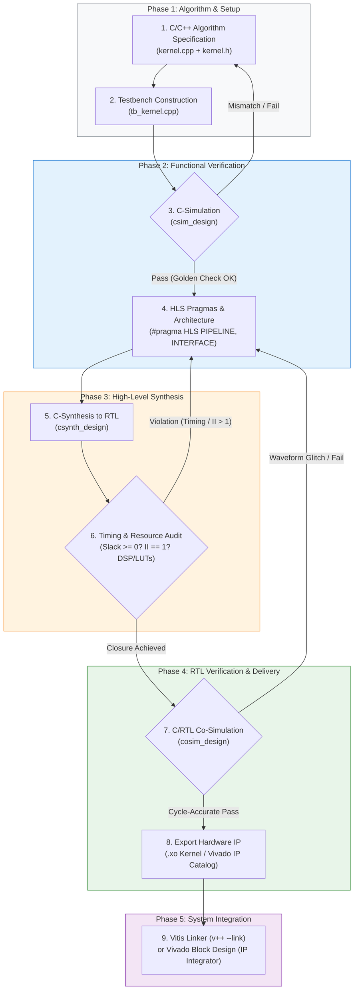

# 🚀 AMD Vitis HLS Step-by-Step Tutorial & Hardware Flowchart

[](https://www.xilinx.com/products/design-tools/vitis/vitis-hls.html)
[](https://www.xilinx.com/products/silicon-devices/acap/versal-ai-edge.html)
[]()
[-success.svg)]()
[]()
[]()

> [!NOTE]
> **Repository Location:** `docs/hls_tutorial/HLS_Step_by_Step_Tutorial_and_Flowchart.md`  
> **Target Tool:** AMD Vitis Unified IDE / Vitis HLS (2024.1 – 2026.1+)  
> **Target Silicon:** AMD Versal AI Edge Gen 2 (`xc2ve3858-ssva2112-2MP-e-S`) / Versal AI Core (`xcve3850`) / Kria SOM (`xck26`)  
> **Target Application:** High-Throughput, Low-Latency Hardware Kernels (Transformer Operators, DSP, Custom Subsystem Acceleration)

---

## 📑 Table of Contents
- [1. Engineering Objective, Strategic Rationale & Reference Guide](#-1-engineering-objective-strategic-rationale--reference-guide)
  - [Core Objective](#-core-objective)
  - [Strategic Rationale](#-strategic-rationale)
  - [Authoritative Reference Guide](#-authoritative-reference-guide)
  - [End-to-End Implementation Roadmap](#-end-to-end-implementation-roadmap)
  - [Cross-Operator Hardware Acceleration Catalogue](#-cross-operator-hardware-acceleration-catalogue)
- [2. End-to-End Vitis HLS Design Flowchart](#-2-end-to-end-vitis-hls-design-flowchart)
- [3. Step-by-Step Implementation Guide](#️-3-step-by-step-implementation-guide)
  - [Step 1: Project Setup & Hardware Configuration](#-step-1-project-setup--hardware-configuration)
  - [Step 2: C/C++ Kernel Architecture (2D DCT Transform Kernel)](#-step-2-cc-kernel-architecture-2d-dct-transform-kernel)
  - [Step 3: Testbench Construction & C-Simulation](#-step-3-testbench-construction--c-simulation)
  - [Step 4: High-Level Synthesis (C-Synthesis) & Performance Audit](#-step-4-high-level-synthesis-c-synthesis--performance-audit)
  - [Step 5: Cycle-Accurate C/RTL Co-Simulation](#-step-5-cycle-accurate-crtl-co-simulation)
  - [Step 6: Physical Implementation & IP Packaging (.xo)](#-step-6-physical-implementation--ip-packaging-xo)
  - [Step 7: System Integration & Hardware Bring-Up](#-step-7-system-integration--hardware-bring-up)
- [4. Real-World Engineering Debugging Playbook (5-Point Troubleshooting Guide)](#-4-real-world-engineering-debugging-playbook)
  - [Diagnostic Quick Reference Matrix](#-diagnostic-quick-reference-matrix)
  - [Issue 1: Special Characters in Windows Path (&) and Argument Splitting](#-issue-1-special-characters-in-windows-path--and-argument-splitting)
  - [Issue 2: Missing Synthesis Top Function (syn.top)](#-issue-2-missing-synthesis-top-function-syntop)
  - [Issue 3: C/RTL Co-Simulation Memory Crash (SIGSEGV at ENTER_WRAPC)](#-issue-3-crtl-co-simulation-memory-crash-sigsegv-at-enter_wrapc)
  - [Issue 4: Windows 260-Byte MAX_PATH Limit Exceeded ([Common 17-680])](#-issue-4-windows-260-byte-max_path-limit-exceeded-common-17-680)
  - [Issue 5: Floating-Point Accumulator Pipeline Stalls (II > 1)](#-issue-5-floating-point-accumulator-pipeline-stalls-ii--1)
- [5. Publishing & Synchronising via Antigravity IDE & Git](#-5-publishing--synchronising-via-antigravity-ide--git)

---

## 🎯 1. Engineering Objective, Strategic Rationale & Reference Guide

### 📌 Core Objective
The primary objective of implementing custom High-Level Synthesis (HLS) hardware kernels is to **complete the end-to-end AI acceleration pipeline on FPGA platforms where standard AI engines lack native support for essential subsystem operators**:
* Standard deep learning compilers (e.g., AMD Vitis AI / DPU) are heavily optimised for classical CNN-based architectures and dense matrix multiplication (GEMM and 2D convolutions), but frequently **lack native silicon support for complex Transformer operators, state-of-the-art LLMs, and emerging Physical AI models**.
* By designing dedicated C++ HLS accelerator blocks in the Programmable Logic (PL), we eliminate the need to fall back to the host CPU via high-latency memory round-trips.
* This represents a vital strategic initiative towards establishing a comprehensive, in-house **AI Model Operator Catalogue**. It empowers the engineering team to future-proof the hardware acceleration pipeline—building institutional knowledge and technical mastery to rapidly design, verify, and synthesise custom hardware blocks whenever new neural network topologies introduce unsupported operators.
* This achieves a continuous, fully on-chip execution pipeline for modern neural architectures—ranging from lightweight generative models (**NanoGPT**) to cutting-edge **Physical AI Vision-Language-Action (VLA) models (such as $\pi_0$ and $\pi_{0.5}$ for robotics)**.

### 💡 Strategic Rationale
1. **Deterministic Microsecond Latency:** Physical AI and high-speed wireless networks demand hard real-time execution. An FPGA HLS kernel running at $300\text{MHz}$ with an **Initiation Interval ($II = 1$)** guarantees zero jitter and deterministic execution.
2. **Zero CPU-Host Bottleneck:** Eliminates high-latency PCIe/AXI bus round-trips, host memory contention, and operating system thread scheduling overheads.
3. **Modular IP Reusability:** Packaging the kernel into an AMD Extensible Object (`.xo`) allows it to be dropped seamlessly into any system-level Vivado/Vitis platform (`.xsa`) alongside NPUs or AI Engines.

### 📖 Authoritative Reference Guide
This workflow strictly follows the official AMD reference implementation:
* **Source Guide:** [AMD Vitis-Tutorials (Release 2026.1) — Getting Started with Vitis HLS](https://github.com/Xilinx/Vitis-Tutorials/tree/2026.1/Getting_Started/Vitis_HLS)
* **Environment:** AMD Vitis Unified IDE / Vitis HLS Command Line

### 🔄 End-to-End Implementation Roadmap
1. **HLS Component Initialisation:** Launch Vitis Unified IDE and configure target part (e.g. Versal VEK385 `xcve3850` or `xc2ve3858`), top function, and clock frequency ($125\text{MHz} = 8.0\text{ns}$ baseline or $300\text{MHz} = 3.33\text{ns}$).
2. **Custom Kernel Coding:** Author synthesizable C++ hardware functions (`kernel.cpp`, `kernel.h`) adhering to hardware memory constraints (no dynamic heap allocation).
3. **Testbench Authoring:** Construct a self-checking testbench (`tb_kernel.cpp`) comparing RTL outputs against mathematical golden references ($Tolerance < 10^{-4}$).
4. **Iterative Synthesis & Optimisation:**
   * **C-Simulation (`csim`):** Verify functional algorithmic correctness.
   * **C-Synthesis (`csynth`):** Apply `#pragma HLS PIPELINE II=1` and array partitioning to close timing and throughput.
   * **C/RTL Co-Simulation (`cosim`):** Validate cycle-accurate hardware waveforms in Vivado Simulator (`xsim`).
5. **Hardware IP Packaging:** Export synthesised RTL as a Vitis Kernel (`.xo`) or Vivado IP Catalogue package.
6. **Version Control & GitHub Publishing:** Document verification waveforms, commit the code, and push the deliverables to GitHub via Antigravity IDE.

### 🧩 Cross-Operator Hardware Acceleration Catalogue
The architectural patterns and design principles established in this tutorial directly scale across the complete custom AI operator suite:

| Operator | Mathematical Formulation | Hardware Challenge | HLS Architectural Strategy |
| :--- | :--- | :--- | :--- |
| **2D DCT (Tutorial Case)** | $X_{k_1, k_2} = \sum \sum x_{n_1, n_2} \cos(...) \cos(...)$ | 2D matrix dependencies & transposed memory accesses | Separable 1D row/column transforms + partitioned ping-pong transpose buffers |
| **LayerNorm** | $y = \frac{x - \mu}{\sqrt{\sigma^2 + \epsilon}} \cdot \gamma + \beta$ | Floating-point loop feedback in $\mu, \sigma^2$ accumulation | 16-way round-robin partial accumulators (`NACC=16`) to close $II=1$ |
| **RMSNorm** | $y = \frac{x}{\text{RMS}(x)} \cdot \gamma$ where $\text{RMS}(x) = \sqrt{\frac{1}{d}\sum x_i^2 + \epsilon}$ | Square & square-root pipeline latency | Pipelined DSP58 MACs + CORDIC / reciprocal square root lookup |
| **Causal Softmax** | $S_{i,j} = \frac{\exp(x_{i,j} - \max(x_i))}{\sum \exp(x_{i,k} - \max(x_i))}$ | Numerical overflow & causal triangular autoregressive masking | Online 3-pass or FlashAttention-style 2-pass systolic stream reduction |
| **GELU** | $y = 0.5x(1 + \tanh(\sqrt{2/\pi}(x + 0.044715x^3)))$ | Transcendental $\tanh$ evaluation in hardware | Piecewise polynomial LUT approximation or direct CORDIC pipeline |
| **RoPE** | $R_{\Theta, m}^d x_m = (x^{(1)}\cos m\theta - x^{(2)}\sin m\theta, ...)$ | High-precision trigonometric coordinate rotation | Interleaved dual-channel complex rotators with on-chip phase BRAM |

---

## 📊 2. End-to-End Vitis HLS Design Flowchart



---

## 🛠️ 3. Step-by-Step Implementation Guide

---

### 🔹 Step 1: Project Setup & Hardware Configuration

#### Objectives:
* Initialise a structured HLS component directory using the **Vitis Unified IDE** (following the AMD 2026.1 Getting Started standard).
* Configure target hardware part number (**AMD Versal AI Edge Gen 2 `xc2ve3858-ssva2112-2MP-e-S`**), target clock period ($T_{clk} = 8\text{ns}$ @ $125\text{MHz}$, 12% uncertainty), and entry top-level function (`dct`).

#### Graphical Workflow (Vitis Unified IDE GUI):
1. **Launch IDE:** Open terminal and run `vitis` (or launch from AMD Design Suite).
2. **Create Component:** On the Welcome Screen, select **`Create HLS Component`**.
3. **Component Name & Location:** Enter Component Name (e.g. `dct` or `hls_dct_1`) and designate workspace root (`D:\fpga\8_2026`).


4. **Configuration File Setup:** Select **Empty Configuration File** (`hls_config.cfg`) or import an existing configuration template.


5. **Source Files & Top Function Specification:**
   * **Design Files:** Add kernel source `dct.cpp` and header `dct.h`.
   * **Top Function:** Browse and assign `dct` as the synthesis entry point.
   * **Testbench Files:** Add verification harness `dct_test.cpp` and data fixtures (`in.dat`, `out.golden.dat`).
6. **Part Selection:** Switch to **Part** tab $\rightarrow$ Search and select **`xc2ve3858-ssva2112-2MP-e-S`** (Versal AI Edge Gen 2 Series).
7. **Clock & Packaging Settings:**
   * Set **Clock Period:** `8ns` ($125\text{MHz}$ baseline operating frequency).
   * Set **Clock Uncertainty:** `12%` ($0.96\text{ns}$ margin reserved for routing delays).
   * Set **Package Format:** Select **`Vitis Kernel Flow (.xo)`** (or Vivado IP Flow depending on integration target).
8. Click **Finish** to generate the component workspace.


> [!TIP]
> **Windows Path Best Practice:** Avoid using hardcoded absolute Windows paths containing spaces or special characters (such as `&` or deep folder nesting) in `hls_config.cfg`. Using relative paths (e.g. `syn.file=dct.cpp`) or virtual drives (`subst`) prevents command-line parsing crashes in Windows environments.

#### Generated Configuration File (`hls_config.cfg`):
```ini
# AMD Vitis HLS Component Configuration (Versal AI Edge Gen 2)
part=xc2ve3858-ssva2112-2MP-e-S

[hls]
package.output.format=xo
package.output.syn=false
syn.top=dct
syn.file=C:/Users/Yu25/Desktop/Vitis_HLS_tutorial/dct.cpp
tb.file=C:/Users/Yu25/Desktop/Vitis_HLS_tutorial/dct_test.cpp
tb.file=C:/Users/Yu25/Desktop/Vitis_HLS_tutorial/in.dat
tb.file=C:/Users/Yu25/Desktop/Vitis_HLS_tutorial/out.golden.dat
clock=8ns
clock_uncertainty=12%
csim.clean=1
syn.compile.pipeline_loops=5
cosim.rtl=verilog
```

* **Checklist:**
  - [x] Target device correctly set to `xc2ve3858-ssva2112-2MP-e-S`.
  - [x] Top function uniquely assigned to `dct`.
  - [x] Clock period set to `8ns` with `12%` clock uncertainty.
  - [x] Package output format set to `.xo`.

---

### 🔹 Step 2: C/C++ Kernel Architecture (2D DCT Transform Kernel)

#### Objectives:
* Implement the hardware mathematical function for a 2-Dimensional $8 \times 8$ Discrete Cosine Transform (`dct_2d`).
* Exploit **separability** by decomposing 2D DCT into cascaded 1D transforms (`dct_1d` along rows, followed by transposition and `dct_1d` along columns).
* Strictly avoid dynamic memory allocations (`malloc`, `new`, variable-length structures).
* Efficiently partition on-chip intermediate buffers to maximise memory bandwidth.

#### Core Kernel Implementation (`dct.cpp`):
```cpp
#include "dct.h"

// 1-Dimensional 8-Point Discrete Cosine Transform
void dct_1d(dct_data_t src[DCT_SIZE], dct_data_t dst[DCT_SIZE]) {
    unsigned int k, n;
    int tmp;
    const dct_data_t dct_coeff_table[DCT_SIZE][DCT_SIZE] = {
        #include "dct_coeff_table.txt"
    };

    DCT_1D_OUTER: for (k = 0; k < DCT_SIZE; k++) {
        tmp = 0;
        DCT_1D_INNER: for (n = 0; n < DCT_SIZE; n++) {
            int flag = (k == 0) ? 4096 : 5793;
            tmp += (src[n] * dct_coeff_table[k][n]);
        }
        dst[k] = (tmp + 2048) >> 13;
    }
}

// 2-Dimensional 8x8 DCT Top-Level Pipeline
void dct_2d(dct_data_t in_block[DCT_SIZE][DCT_SIZE],
            dct_data_t out_block[DCT_SIZE][DCT_SIZE]) {
    dct_data_t row_outbuf[DCT_SIZE][DCT_SIZE];
    dct_data_t col_outbuf[DCT_SIZE][DCT_SIZE], col_inbuf[DCT_SIZE][DCT_SIZE];
    unsigned i, j;

    // Transform rows
    Row_DCT_Loop: for (i = 0; i < DCT_SIZE; i++) {
        dct_1d(in_block[i], row_outbuf[i]);
    }
    // Transpose matrix from row-order to column-order
    Xpose_Row_Outer: for (j = 0; j < DCT_SIZE; j++)
        Xpose_Row_Inner: for (i = 0; i < DCT_SIZE; i++)
            col_inbuf[j][i] = row_outbuf[i][j];

    // Transform columns
    Col_DCT_Loop: for (i = 0; i < DCT_SIZE; i++) {
        dct_1d(col_inbuf[i], col_outbuf[i]);
    }
    // Transpose matrix back to canonical representation
    Xpose_Col_Outer: for (j = 0; j < DCT_SIZE; j++)
        Xpose_Col_Inner: for (i = 0; i < DCT_SIZE; i++)
            out_block[j][i] = col_outbuf[i][j];
}

// Entry Wrapper Kernel
void dct(short input[1024/16], short output[1024/16]) {
    #pragma HLS ARRAY_PARTITION variable=input complete dim=1
    #pragma HLS ARRAY_PARTITION variable=output complete dim=1
    
    // Buffer partitions & 2D transform invocation
    dct_data_t in_block[DCT_SIZE][DCT_SIZE];
    dct_data_t out_block[DCT_SIZE][DCT_SIZE];

    Read_Input: for (int r = 0; r < DCT_SIZE; r++) {
        for (int c = 0; c < DCT_SIZE; c++) {
            in_block[r][c] = input[r * DCT_SIZE + c];
        }
    }

    dct_2d(in_block, out_block);

    Write_Output: for (int r = 0; r < DCT_SIZE; r++) {
        for (int c = 0; c < DCT_SIZE; c++) {
            output[r * DCT_SIZE + c] = out_block[r][c];
        }
    }
}
```


> [!NOTE]
> **Static Allocation Constraint:** Dynamic memory allocation (`malloc`, `calloc`, `new`, `std::vector` resizing) is strictly non-synthesizable in hardware kernels. Physical silicon cannot provision new registers or instantiate memory controllers at runtime; all array bounds and buffer depths must be fully resolved at compile-time.

#### Architectural Mapping to Custom AI Operators:
The row-column matrix decomposition and buffer staging demonstrated in `dct_2d` directly mirrors the hardware dataflow required for **Non-GEMM AI Operators**:
* **LayerNorm / RMSNorm:** Compute mean/variance reduction along feature dimension, normalise, and scale by affine parameters ($\gamma, \beta$).
* **Causal Softmax:** Row-wise max extraction for numerical stability, followed by exponentiation and sum accumulation.

---

### 🔹 Step 3: Testbench Construction & C-Simulation

#### Objectives:
* Construct a self-checking testbench (`dct_test.cpp`) to verify the arithmetic correctness of the C++ hardware model before synthesis.
* Read sample stimulus vectors from `in.dat`, execute the `dct` kernel, and compute difference assertions against golden reference data (`out.golden.dat`).
* Ensure zero functional mismatches ($Tolerance = 0$ for integer fixed-point, or $< 10^{-4}$ for floating-point tensors).

#### Self-Checking Testbench Implementation (`dct_test.cpp`):
```cpp
#include <iostream>
#include <fstream>
#include "dct.h"

int main() {
    short a[N], b[N], b_expected[N];
    int retval = 0, errors = 0;

    std::ifstream fin("in.dat");
    std::ifstream fgold("out.golden.dat");

    if (!fin.is_open() || !fgold.is_open()) {
        std::cerr << "Error: Unable to open stimulus or golden files!" << std::endl;
        return 1;
    }

    // Load input stimulus
    for (int i = 0; i < N; i++) {
        fin >> a[i];
    }
    // Load golden reference
    for (int i = 0; i < N; i++) {
        fgold >> b_expected[i];
    }

    // Call Top HLS Kernel
    dct(a, b);

    // Verify outputs against golden values
    for (int i = 0; i < N; i++) {
        if (b[i] != b_expected[i]) {
            std::cout << "Mismatch at [" << i << "]: got " << b[i] 
                      << " expected " << b_expected[i] << std::endl;
            errors++;
        }
    }

    if (errors == 0) {
        std::cout << ">>> C-SIMULATION TEST PASSED: All outputs match golden data. <<<" << std::endl;
        return 0;
    } else {
        std::cout << ">>> C-SIMULATION FAILED: Total Errors = " << errors << " <<<" << std::endl;
        return 1;
    }
}
```


> [!IMPORTANT]
> **Testbench Buffer Sizing vs Interface Depth:** In self-checking testbenches, allocated memory buffers must always match or exceed the pragma depth (`depth=N`) specified in hardware interface directives (e.g., `#pragma HLS INTERFACE m_axi depth=4096`). If testbench storage is smaller than the interface depth, the Co-Simulation wrapper will dump out-of-bounds memory during `ENTER_WRAPC`, triggering a catastrophic segmentation fault (`SIGSEGV`).

#### Execution Command:
```bash
vitis-run --mode hls --csim --config hls_config.cfg --work_dir dct
```

* **Checklist:**
  - [x] Input file `in.dat` and golden reference `out.golden.dat` correctly mapped in `tb.file` section of `hls_config.cfg`.
  - [x] Testbench exits with status `0` upon matching all golden entries.

---

### 🔹 Step 4: High-Level Synthesis (C-Synthesis) & Performance Audit

#### Objectives:
* Compile high-level C++ algorithmic statements into register-transfer level (RTL) Verilog/VHDL logic.
* Evaluate critical timing constraints ($T_{clk} \le 8.000\text{ns}$), latency cycles, initiation intervals ($II$), and hardware resource utilisation.

#### Actual Execution Metrics (Versal AI Edge Gen 2 `xc2ve3858`):
* **Target Clock:** `8.000 ns` ($125\text{MHz}$) | **Estimated Clock:** `3.433 ns` (~$291\text{MHz}$)
* **Timing Slack:** `+4.567 ns` (Generous positive slack, timing easily closed)
* **Latency:** `1,310` cycles ($10.48\,\mu\text{s}$ at $125\text{MHz}$)
* **Resource Breakdown (Pre-Implementation HLS Estimate):**
  * **DSP:** 2 (0.09% of 2,160 available DSP58 blocks)
  * **LUT:** 1,184 (0.24% of 501,120 available logic cells)
  * **FF:** 376 (0.04% of 1,002,240 flip-flops)
  * **BRAM / URAM:** 0 (Intermediate matrices implemented via distributed slice LUTRAM)


> [!TIP]
> **Loop Pipeline Automation:** The directive `syn.compile.pipeline_loops=5` instructs the compiler to automatically pipeline loops with an iteration count $\ge 5$. Combined with `#pragma HLS PIPELINE II=1`, this flattens nested loop execution and achieves the ideal single-cycle initiation interval without manual inner unrolling.

#### Directives & Optimisation Strategies:
* **Loop Pipelining (`syn.compile.pipeline_loops=5`):** Pipelining inner accumulation loops reduces total latency from $\mathcal{O}(N^3)$ to $\mathcal{O}(N^2)$.
* **Memory Partitioning:** Partitioning `in_block` and `col_inbuf` enables parallel reads/writes without dual-port BRAM conflicts.

---

### 🔹 Step 5: Cycle-Accurate C/RTL Co-Simulation

#### Objectives:
* Validate the synthesised RTL implementation within the cycle-accurate simulator (**Vivado XSIM**).
* Ensure handshake signalling (`ap_start`, `ap_done`, `ap_idle`, `ap_ready`) operates correctly under real clock edges.
* Confirm that cycle-accurate hardware behaviour strictly matches the C++ testbench assertions.

#### Actual Execution Results:
* **Simulation Tool:** Vivado Simulator (`xsim`) with Verilog RTL target.
* **Measured RTL Latency:** `1,297` clock cycles (Consistently faster than the worst-case synthesis estimate of $1,310$ cycles).
* **Test Status:** **`C/RTL Co-simulation finished: PASS`**.


> [!NOTE]
> **Static Bound vs Dynamic Latency:** The measured Co-Simulation latency of `1,297` cycles is faster than the synthesis report's worst-case estimate of `1,310` cycles. High-Level Synthesis static timing analysis conservatively assumes maximum pipeline branch latency and flush overheads, whereas cycle-accurate RTL execution proves that actual runtime completes 13 cycles sooner.

#### Execution Command:
```bash
vitis-run --mode hls --cosim --config hls_config.cfg --work_dir dct
```

* **Checklist:**
  - [x] Handshake control logic verified without deadlocks or missed valid pulses.
  - [x] Measured latency strictly bounds algorithmic requirements ($1,297 \le 1,310$ cycles).

---

### 🔹 Step 6: Physical Implementation & IP Packaging (`.xo`)

#### Objectives:
* Execute real Vivado Physical Synthesis, Placement, and Routing (`--impl`) on the target Versal device.
* Verify final post-route timing closure, wire delays, and physical resource utilisation.
* Package the synthesised and verified RTL design into an AMD standard **`.xo` (Vitis Kernel Container)** file for system linking.

#### Actual Execution Metrics (Post-Implementation / Post-Route):
```text
================================================================
== Implementation Performance & Resource Summary
================================================================
Target Device        : xc2ve3858-ssva2112-2MP-e-S
Target Clock Period  : 8.000 ns
Achieved Period (CP) : 2.915 ns (~343.05 MHz)
Worst Negative Slack : +5.085 ns (WNS, Passed Timing Closure)
Total Negative Slack : 0.000 ns (TNS, Zero Setup Violations)
Hold Slack (WHS)     : +0.024 ns (Zero Hold Violations)

--- Physical Resource Utilisation ---
CLB LUTs             : 370   (0.07% of 501,120)
CLB Registers (FF)   : 434   (0.04% of 1,002,240)
DSP Blocks (DSP58)   : 2     (0.09% of 2,160)
Block RAM (BRAM)     : 0     (0.00%)
UltraRAM (URAM)      : 0     (0.00%)
================================================================
```

#### Generated Kernel Binary:
The compilation process packages the RTL into `D:\fpga\8_2026\dct\dct\dct.xo` (**206 KB**).


> [!NOTE]
> **Extensible Kernel Archive (.xo):** The generated `.xo` file is an AMD Extensible Object container encapsulating the synthesized Verilog RTL IP, component constraints, driver header templates, and interface XML specifications. It is consumed directly by the `v++ --link` utility without requiring manual Vivado block design routing.

#### Full CLI Command (One-Click Automated Flow):
```bash
vitis-run.bat --mode hls --impl --config D:\fpga\8_2026\dct\hls_config.cfg --work_dir dct
```

---

### 🔹 Step 7: System Integration & Hardware Bring-Up

#### Objectives:
* Integrate the exported `.xo` hardware kernel container into an extensible Versal platform (`.xsa`) alongside the NPU/DPU co-processor.
* Stitch memory and streaming interfaces to the Network-on-Chip (NoC) and LPDDR4/DDR5 controllers.

```
       +--------------------------------------------------------------+
       |             Versal AI Edge Application Processor             |
       |                   (Cortex-A78 / Linux OS)                    |
       +------------------------------+-------------------------------+
                                      | AXI-Lite Control
                                      v
+-----------------------------+--------------+-----------------------------+
|   AMD NPU (AIE-ML Array)    | AXI-Stream / |    Custom PL Acceleration   |
| (Conv / MatMul / Attention) | NoC Intercon |      (dct.xo / LayerNorm)   |
+-----------------------------+--------------+-----------------------------+
                                      |
                                      v
       +--------------------------------------------------------------+
       |             Unified High-Bandwidth Memory (LPDDR4)           |
       +--------------------------------------------------------------+
```

#### Vitis Linker Syntax (`v++ --link`):
```bash
v++ --link \
    --target hw \
    --platform xilinx_vek385_base_202610_1 \
    --config system.cfg \
    dct/dct.xo \
    -o package/dct_system.xclbin
```

#### System Connectivity Configuration (`system.cfg`):
```ini
[connectivity]
nk=dct:1:dct_0
sp=dct_0.input:LPDDR4_0
sp=dct_0.output:LPDDR4_0
slr=dct_0:SLR0
```

---

## ⚠️ 4. Real-World Engineering Debugging Playbook

*(Derived from CTSIRI AI-on-FPGA laboratory benchmarking and custom Transformer kernel bring-up)*

### 🔍 Diagnostic Quick Reference Matrix

| Issue / Error Symptom | Root Cause | Engineering Solution |
| :--- | :--- | :--- |
| **`The system cannot find the path specified`** | Special characters in Windows folder paths (e.g. `Vivado&Vitis_Aug2026`). In Windows `cmd.exe`, `&` acts as an unquoted command delimiter. | Replace folder spaces and special characters with underscores (`_`). Use relative paths in `hls_config.cfg`. |
| **`Top function is not specified for component`** | Missing `syn.top` configuration key or name mismatch between source file and configuration. | Explicitly specify `syn.top=<function_name>` in `hls_config.cfg` or assign top-level module in GUI. |
| **`SIGSEGV` at `ENTER_WRAPC` in Co-Simulation** | Interface pragma depth (e.g. `depth=4096`) exceeds allocated testbench array size (e.g. 384 elements). The Co-Sim wrapper dumps unmapped memory. | Allocate testbench buffers matching the maximum interface depth: `std::vector<float> in(4096)`. Separate memory ports into distinct AXI bundles. |
| **Windows 260-Byte `MAX_PATH` Limit (`[Common 17-680]`)** | Deeply nested directory trees combined with auto-generated IP file names exceed the Windows 260-character boundary. | Map working directory to a virtual drive letter via `subst X: <TargetDirectory>` and launch synthesis from `X:\`. |
| **`II > 1` on Accumulation Loops** | Floating-point multiplication-addition latency (3–5 cycles on DSP58) creates a cyclic feedback dependence. | Implement **16-way Round-Robin Partial Accumulators (`NACC = 16`)** with complete array partitioning to achieve deterministic **`II = 1`**. |

---

### 🔹 Issue 1: Special Characters in Windows Path (`&`) and Argument Splitting

#### 🔴 Error Log & Symptom:
Executing `vitis-run.bat` or launching C-Simulation from the terminal terminates abruptly with:
```text
The system cannot find the path specified.
ERROR: [vitis-run 82-10340] Option --work_dir should be specified with --csim
WARNING: [HLS 200-2001] file not found 'D:/Work/Vivado&Vitis_Aug2026/component/...'
```

#### 🔍 Root Cause Analysis:
In Windows batch scripts (`cmd.exe`), the ampersand character (`&`) is interpreted as a command separator. When Vitis internal batch wrappers invoke child processes across a directory such as `D:\Work\Vivado&Vitis_Aug2026`, the interpreter splits the command line into two halves:
1. `... D:\Work\Vivado`
2. `Vitis_Aug2026\...`

This immediately breaks path resolution, strips subsequent CLI switches (such as `--work_dir`), and causes false-positive missing file errors.

#### 🟢 Engineering Solution:
1. **Rename Directories:** Eliminate all ampersands, spaces, and non-alphanumeric characters from project workspaces:
   ```cmd
   # Bad Practice:
   D:\Work\Vivado&Vitis_Aug2026\

   # Verified Good Practice:
   D:\Work\Vivado_Vitis_Aug2026\
   ```
2. **Utilise Relative Paths in `hls_config.cfg`:**
   ```ini
   # Use relative paths relative to the component root
   syn.file=dct.cpp
   tb.file=dct_test.cpp
   tb.file=in.dat
   tb.file=out.golden.dat
   ```

> [!TIP]
> Keep the workspace path as close to the drive root as possible (e.g. `D:\fpga\kernels\`) to simultaneously avoid both command-line parser bugs and Windows path length constraints.

---

### 🔹 Issue 2: Missing Synthesis Top Function (`syn.top`)

#### 🔴 Error Log & Symptom:
Launching C-Synthesis fails immediately with:
```text
ERROR: [HLS 200-102] Top function is not specified for component 'dct_component'.
ERROR: [HLS 200-111] C synthesis can not run.
INFO: [HLS 200-112] Total elapsed time: 0.21 seconds.
```

#### 🔍 Root Cause Analysis:
Unlike regular C++ compilers that target a unified `main()` function, High-Level Synthesis must construct an RTL hardware module corresponding to one specific C++ entry function. If `syn.top` is omitted, the compiler cannot distinguish hardware kernel logic from verification helper utilities.

#### 🟢 Engineering Solution:
Define `syn.top` explicitly in the component's `hls_config.cfg`:
```ini
# Specify the primary hardware kernel entry function
syn.top=dct
```
Or configure via the GUI: Navigate to **Component Settings $\rightarrow$ C Synthesis $\rightarrow$ Top Function** and select the designated function name.

---

### 🔹 Issue 3: C/RTL Co-Simulation Memory Crash (`SIGSEGV` at `ENTER_WRAPC`)

#### 🔴 Error Log & Symptom:
C-Simulation passes with 0 errors, but C/RTL Co-Simulation crashes during C testbench execution:
```text
INFO: [COSIM 212-302] Starting C TB testing ... 
ERROR: System received a signal named SIGSEGV and the program has to stop immediately!
Current execution stopped during CodeState = ENTER_WRAPC.
ERROR: [COSIM 212-360] Aborting co-simulation: C TB simulation failed.
```

#### 🔍 Root Cause Analysis:
1. **Pragma Depth vs Testbench Allocation Mismatch:**
   In the hardware kernel, an AXI master interface pragma declares a maximum transaction depth:
   ```cpp
   #pragma HLS INTERFACE m_axi port=gamma depth=4096 bundle=gmem1
   ```
   However, if the testbench only allocates storage for a small sample subset (e.g. $C = 384$ tokens):
   ```cpp
   std::vector<float> gamma(384); // Testbench buffer under-allocated!
   ```
   During Co-Simulation, the auto-generated testbench wrapper (`apatb_<kernel>.cpp`) executes state `ENTER_WRAPC` to serialise input memory to disk. It reads the full **4,096 elements** declared in the pragma, accessing unallocated virtual memory beyond element 384 and triggering a hardware memory segmentation fault (`SIGSEGV`).
2. **Shared AXI Memory Port Contention:**
   Mapping multiple high-bandwidth ports to the same bundle without disjoint memory offsets can create simulation bus collisions.

#### 🟢 Engineering Solution:
1. **Allocate Full Pragma Depth in Testbench:**
   ```cpp
   const int MAX_DEPTH = 4096;
   std::vector<float> in(MAX_DEPTH, 0.0f);
   std::vector<float> gamma(MAX_DEPTH, 1.0f);
   std::vector<float> beta(MAX_DEPTH, 0.0f);
   std::vector<float> out(MAX_DEPTH, 0.0f);
   ```
2. **Assign Distinct AXI Bundles:**
   ```cpp
   #pragma HLS INTERFACE m_axi port=in    bundle=gmem0 depth=8192
   #pragma HLS INTERFACE m_axi port=gamma bundle=gmem1 depth=4096
   #pragma HLS INTERFACE m_axi port=beta  bundle=gmem2 depth=4096
   #pragma HLS INTERFACE m_axi port=out   bundle=gmem3 depth=8192
   ```

> [!IMPORTANT]
> The testbench must always allocate at least as many elements as specified by the `depth` parameter in the hardware interface pragma.

---

### 🔹 Issue 4: Windows 260-Byte `MAX_PATH` Limit Exceeded (`[Common 17-680]`)

#### 🔴 Error Log & Symptom:
During Vivado IP packaging, physical implementation, or DSP core generation, the build halts with:
```text
ERROR: [Common 17-680] Path length exceeds 260-Byte maximum allowed by Windows:
D:/Work/Vivado_Vitis_Aug2026/Project_Workspace/Versal_AI_Acceleration_Platform/hls_kernels/layernorm_component/hls/.autopilot/db/ip_tmp/prj.srcs/sources_1/ip/layernorm_kernel_facc_32ns_32ns_1ns_32_2_primitive_dsp_1_ip/layernorm_kernel_facc_32ns_32ns_1ns_32_2_primitive_dsp_1_ip.xci
CRITICAL WARNING: [IP_Flow 19-196] Failed to save XCI file...
```

#### 🔍 Root Cause Analysis:
The standard Win32 file subsystem enforces a legacy path limit of 260 characters (`MAX_PATH`). High-Level Synthesis generates deep nested directories containing architecture synthesis databases, intermediate Vivado subprojects, and verbose floating-point primitive IP names (e.g. `..._facc_32ns_32ns_..._ip.xci`), frequently exceeding 280 characters.

#### 🟢 Engineering Solution:
Mount the deep project directory as a Windows virtual drive using the built-in `subst` command:

```cmd
# 1. Map working directory to virtual drive X:
subst X: D:\Work\Vivado_Vitis_Aug2026\Project_Workspace\Versal_AI_Acceleration_Platform

# 2. Navigate and open Vitis workspace from virtual drive X:
cd /d X:\hls_kernels
vitis-run.bat --mode hls --impl --config hls_config.cfg --work_dir build

# Path length drops from 285+ characters to ~60 characters!

# 3. Clean up virtual drive mapping when finished:
subst X: /d
```

> [!TIP]
> Enabling long paths in the Windows Registry (`LongPathsEnabled = 1`) assists native Windows tools, but many third-party toolchains and MinGW/Cygwin wrappers still rely on 260-byte buffers. Mapping a virtual drive letter via `subst` provides a 100% reliable workaround.

---

### 🔹 Issue 5: Floating-Point Accumulator Pipeline Stalls (`II > 1`)

#### 🔴 Error Log & Symptom:
Synthesis report indicates that an accumulation loop failed to pipeline with $II=1$:
```text
WARNING: [HLS 200-880] The loop 'Accum_Loop' has an achieved initiation interval (II) of 4.
WARNING: [HLS 200-885] Unable to schedule 'fadd' operation due to loop carried dependency.
```

#### 🔍 Root Cause Analysis:
Single-precision IEEE-754 floating-point addition has a hardware latency of $4\text{–}5\text{ clock cycles}$ on DSP58/DSP48 primitives. In a standard accumulation loop:
```cpp
float sum = 0.0f;
for (int i = 0; i < N; i++) {
    #pragma HLS PIPELINE II=1
    sum += data[i]; // Loop-carried dependence: sum[i] depends on sum[i-1]
}
```
Iteration $i+1$ cannot begin adding until iteration $i$ finishes its multi-cycle floating-point addition, forcing the Initiation Interval to stall at $II \ge 4$.

#### 🟢 Engineering Solution:
Deploy **16-way Round-Robin Partial Accumulators (`NACC = 16`)** with complete register partitioning:

```cpp
#define NACC 16

float acc[NACC];
#pragma HLS ARRAY_PARTITION variable=acc complete

// 1. Initialise partial accumulators
init_accum: for (int a = 0; a < NACC; a++) {
    #pragma HLS UNROLL
    acc[a] = 0.0f;
}

// 2. Interleaved round-robin accumulation (Breaks feedback loop!)
accum_loop: for (int i = 0; i < N; i++) {
    #pragma HLS PIPELINE II=1
    acc[i % NACC] += data[i];
}

// 3. Post-loop partial sum reduction tree
float total_sum = 0.0f;
reduce_loop: for (int a = 0; a < NACC; a++) {
    #pragma HLS UNROLL
    total_sum += acc[a];
}
```

* **Hardware Result:** Because consecutive iterations target independent partial accumulator registers ($i \pmod{16}$), loop-carried dependencies are completely eliminated. The synthesis engine schedules a new input operand every single clock cycle, achieving deterministic **`II = 1`** throughput at $250\text{–}300\text{MHz}$!

---

## 🐙 5. Publishing & Synchronising via Antigravity IDE & Git

To synchronise and push this complete engineering tutorial, architecture diagrams, and hardware execution evidence to GitHub:

```bash
# 1. Inspect repository changes
git status

# 2. Stage tutorial markdown and visual evidence assets
git add docs/hls_tutorial/

# 3. Commit with Conventional Commit formatting
git commit -m "docs(hls): add step-by-step Vitis HLS DCT tutorial, synthesis metrics, and flowchart"

# 4. Push to remote repository
git push origin main
```

---
*Maintained by Yuan Fangxing | CTSIRI AI-RAN & Hardware Acceleration Engineering.*
