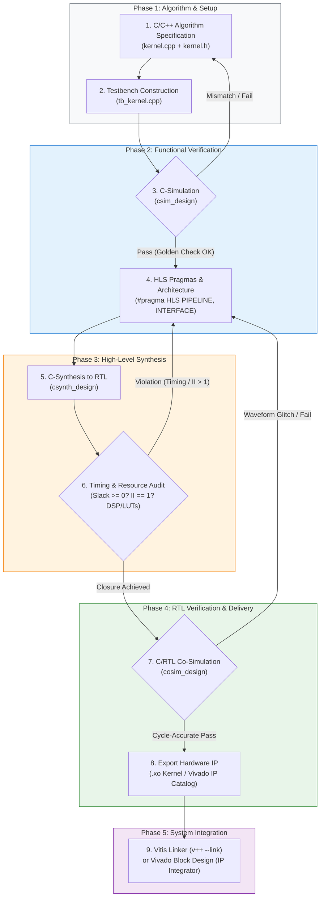

# 🚀 AMD Vitis HLS Step-by-Step Tutorial & Hardware Flowchart

[](https://www.xilinx.com/products/design-tools/vitis/vitis-hls.html)
[](https://www.xilinx.com/products/silicon-devices/acap/versal-ai-edge.html)
[]()
[-success.svg)]()
[]()
[]()

> [!NOTE]
> **Repository Location:** `docs/hls_tutorial/HLS_Step_by_Step_Tutorial_and_Flowchart.md`  
> **Target Tool:** AMD Vitis Unified IDE / Vitis HLS (2026.1)  
> **Target Silicon:** AMD Versal AI Edge Gen 2 (`xc2ve3858-ssva2112-2MP-e-S`) 
> **Target Application:** High-Throughput, Low-Latency Hardware Kernels (Transformer Operators, DSP, Custom Subsystem Acceleration)

---

## 📑 Table of Contents
- [1. Engineering Objective, Strategic Rationale & Reference Guide](#-1-engineering-objective-strategic-rationale--reference-guide)
  - [Core Objective](#-core-objective)
  - [Authoritative Reference Guide](#-authoritative-reference-guide)
  - [End-to-End Implementation Roadmap](#-end-to-end-implementation-roadmap)
  - [Cross-Operator Hardware Acceleration Catalogue](#-cross-operator-hardware-acceleration-catalogue)
- [2. End-to-End Vitis HLS Design Flowchart](#-2-end-to-end-vitis-hls-design-flowchart)
- [3. Step-by-Step Implementation Guide](#️-3-step-by-step-implementation-guide)
  - [Step 1: Project Setup & Hardware Configuration](#-step-1-project-setup--hardware-configuration)
  - [Step 2: C/C++ Kernel Architecture (2D DCT Transform Kernel)](#-step-2-cc-kernel-architecture-2d-dct-transform-kernel)
  - [Step 3: Testbench Construction & C-Simulation](#-step-3-testbench-construction--c-simulation)
  - [Step 4: High-Level Synthesis (C-Synthesis) & Performance Audit](#-step-4-high-level-synthesis-c-synthesis--performance-audit)
  - [Step 5: Cycle-Accurate C/RTL Co-Simulation](#-step-5-cycle-accurate-crtl-co-simulation)
  - [Step 6: Physical Implementation & IP Packaging (.xo)](#-step-6-physical-implementation--ip-packaging-xo)
  - [Step 7: System Integration & Hardware Bring-Up](#-step-7-system-integration--hardware-bring-up)

---

## 🎯 1. Engineering Objective, Strategic Rationale & Reference Guide

### 📌 Core Objective
The primary objective of implementing custom High-Level Synthesis (HLS) hardware kernels is to **complete the end-to-end AI acceleration pipeline on FPGA platforms where standard AI engines lack native support for essential subsystem operators**:
* Standard deep learning compilers (e.g., AMD Vitis AI / DPU) are heavily optimised for classical CNN-based architectures and dense matrix multiplication (GEMM and 2D convolutions), but frequently **lack native silicon support for complex Transformer operators, state-of-the-art LLMs, and emerging Physical AI models**.
* By designing dedicated C++ HLS accelerator blocks in the Programmable Logic (PL), we eliminate the need to fall back to the host CPU via high-latency memory round-trips.
* This represents a vital strategic initiative towards establishing a comprehensive, in-house **AI Model Operator Catalogue**. It empowers the engineering team to future-proof the hardware acceleration pipeline—building institutional knowledge and technical mastery to rapidly design, verify, and synthesise custom hardware blocks whenever new neural network topologies introduce unsupported operators.
* This achieves a continuous, fully on-chip execution pipeline for modern neural architectures—ranging from lightweight generative models (**NanoGPT**) to cutting-edge **Physical AI Vision-Language-Action (VLA) models (such as $\pi_0$ and $\pi_{0.5}$ for robotics)**.

### 📖 Authoritative Reference Guide
This workflow follows the official AMD reference implementation:
* **Source Guide:** [AMD Vitis-Tutorials (Release 2026.1) — Getting Started with Vitis HLS](https://github.com/Xilinx/Vitis-Tutorials/tree/2026.1/Getting_Started/Vitis_HLS)
* **Environment:** AMD Vitis Unified IDE / Vitis HLS Command Line

### 🔄 End-to-End Implementation Roadmap
- **HLS Component Initialisation:** Launch Vitis Unified IDE and configure target part (Versal VEK385), top function, and clock frequency ($125\text{MHz} = 8.0\text{ns}$).
- **Custom Kernel Coding:** Author synthesizable C++ hardware functions (`kernel.cpp`, `kernel.h`) adhering to hardware memory constraints (no dynamic heap allocation).
- **Testbench Authoring:** Construct a self-checking testbench (`tb_kernel.cpp`) comparing RTL outputs against mathematical golden references ($Tolerance < 10^{-4}$).
- **Iterative Synthesis & Optimisation:**
   * **C-Simulation (`csim`):** Verify functional algorithmic correctness.
   * **C-Synthesis (`csynth`):** Apply `#pragma HLS PIPELINE II=1` and array partitioning to close timing and throughput.
   * **C/RTL Co-Simulation (`cosim`):** Validate cycle-accurate hardware waveforms in Vivado Simulator (`xsim`).
- **Hardware IP Packaging:** Export synthesised RTL as a Vitis Kernel (`.xo`) or Vivado IP Catalogue package.

---
### 🧩 Cross-Operator Hardware Acceleration Catalogue
The architectural patterns and design principles established in this tutorial directly scale across the complete custom AI operator suite:

| Operator | Mathematical Formulation | Hardware Challenge | HLS Architectural Strategy |
| :--- | :--- | :--- | :--- |
| **2D DCT (Tutorial)** | $X_{k_1, k_2} = \sum \sum x_{n_1, n_2} \cos(...) \cos(...)$ | 2D matrix dependencies & transposed memory accesses | Separable 1D row/column transforms + partitioned ping-pong transpose buffers |

---

## 📊 2. End-to-End Vitis HLS Design Flowchart



---

## 🛠️ 3. Step-by-Step Implementation Guide

---

### 🔹 Step 1: Project Setup & Hardware Configuration

#### Objectives:
* Initialise a structured HLS component directory using the **Vitis Unified IDE** (following the AMD 2026.1 Getting Started).
* Configure target hardware part number (**AMD Versal AI Edge Gen 2 `xc2ve3858-ssva2112-2MP-e-S`**), target clock period ($T_{clk} = 8\text{ns}$ @ $125\text{MHz}$, 12% uncertainty), and entry top-level function (`dct`).

#### Graphical Workflow (Vitis Unified IDE GUI):
1. **Launch IDE:** Open terminal and run `vitis` (or launch from AMD Design Suite).
2. **Create Component:** On the Welcome Screen, select **`Create HLS Component`**.
3. **Component Name & Location:** Enter Component Name (e.g. `dct` or `hls_dct_1`) and designate workspace root (`D:\fpga\8_2026`).


4. **Configuration File Setup:** Select **Empty Configuration File** (`hls_config.cfg`) or import an existing configuration template.


5. **Source Files & Top Function Specification:**
   * **Design Files:** Add kernel source `dct.cpp` and header `dct.h`.
   * **Top Function:** Browse and assign `dct` as the synthesis entry point.
   * **Testbench Files:** Add verification harness `dct_test.cpp` and data fixtures (`in.dat`, `out.golden.dat`).
6. **Part Selection:** Switch to **Part** tab $\rightarrow$ Search and select **`xc2ve3858-ssva2112-2MP-e-S`** (Versal AI Edge Gen 2 Series).
7. **Clock & Packaging Settings:**
   * Set **Clock Period:** `8ns` ($125\text{MHz}$ baseline operating frequency).
   * Set **Clock Uncertainty:** `12%` ($0.96\text{ns}$ margin reserved for routing delays).
   * Set **Package Format:** Select **`Vitis Kernel Flow (.xo)`** (or Vivado IP Flow depending on integration target).
8. Click **Finish** to generate the component workspace.


#### Generated Configuration File (`hls_config.cfg`):
```ini
# AMD Vitis HLS Component Configuration (Versal AI Edge Gen 2)
part=xc2ve3858-ssva2112-2MP-e-S

[hls]
package.output.format=xo
package.output.syn=false
syn.top=dct
syn.file=dct.cpp
tb.file=dct_test.cpp
tb.file=in.dat
tb.file=out.golden.dat
clock=8ns
clock_uncertainty=12%
csim.clean=1
syn.compile.pipeline_loops=5
cosim.rtl=verilog
```

---

### 🔹 Step 2: C/C++ Kernel Architecture (2D DCT Transform Kernel)

#### Objectives:
* Implement the hardware mathematical function for a 2-Dimensional $8 \times 8$ Discrete Cosine Transform (`dct_2d`).
* Exploit **separability** by decomposing 2D DCT into cascaded 1D transforms (`dct_1d` along rows, followed by transposition and `dct_1d` along columns).
* Strictly avoid dynamic memory allocations (`malloc`, `new`, variable-length structures).
* Efficiently partition on-chip intermediate buffers to maximise memory bandwidth.

#### Header Definitions (`dct.h`):
```cpp
/*
# Copyright (C) 2023, Advanced Micro Devices, Inc. All rights reserved.
# SPDX-License-Identifier: X11
*/

#ifndef __DCT_H__
#define __DCT_H__

#include <fstream>
#include <iostream>
#include <iomanip>
#include <cstdlib>

#define DW 16
#define N (1024 / DW)
#define NUM_TRANS 16

typedef short dct_data_t;

#define DCT_SIZE 8
#define CONST_BITS 13
#define DESCALE(x, n) (((x) + (1 << ((n) - 1))) >> (n))

extern "C" {
  void dct(short input[N], short output[N]);
}

#endif // __DCT_H__
```

#### Core Kernel Implementation (`dct.cpp`):
```cpp
/*
# Copyright (C) 2023, Advanced Micro Devices, Inc. All rights reserved.
# SPDX-License-Identifier: X11
*/

#include "dct.h"

// 1-Dimensional 8-Point Discrete Cosine Transform (DCT-II)
void dct_1d(dct_data_t src[DCT_SIZE], dct_data_t dst[DCT_SIZE])
{
   unsigned int k, n;
   int tmp;

   // Pre-computed fixed-point DCT coefficient matrix (8x8)
   const dct_data_t dct_coeff_table[DCT_SIZE][DCT_SIZE] = {
#include "dct_coeff_table.txt"
   };

DCT_Outer_Loop:
   for (k = 0; k < DCT_SIZE; k++) {
DCT_Inner_Loop:
      for (n = 0, tmp = 0; n < DCT_SIZE; n++) {
         int coeff = (int)dct_coeff_table[k][n];
         tmp += src[n] * coeff; // 16-bit x 16-bit multiply accumulating into 32-bit
      }
      // Apply symmetrical rounding addition (1 << 12) and shift by CONST_BITS (13)
      dst[k] = DESCALE(tmp, CONST_BITS);
   }
}

// 2-Dimensional 8x8 DCT Kernel using Separable Row-Column Decomposition
void dct_2d(dct_data_t in_block[DCT_SIZE][DCT_SIZE],
      dct_data_t out_block[DCT_SIZE][DCT_SIZE])
{
   dct_data_t row_outbuf[DCT_SIZE][DCT_SIZE];
   dct_data_t col_outbuf[DCT_SIZE][DCT_SIZE], col_inbuf[DCT_SIZE][DCT_SIZE];
   unsigned i, j;

   // Stage 1: Compute 1D-DCT across all rows
Row_DCT_Loop:
   for (i = 0; i < DCT_SIZE; i++) {
      dct_1d(in_block[i], row_outbuf[i]);
   }

   // Stage 2: Transpose data matrix (corner-turn) to reuse 1D-DCT row hardware
Xpose_Row_Outer_Loop:
   for (j = 0; j < DCT_SIZE; j++)
Xpose_Row_Inner_Loop:
      for (i = 0; i < DCT_SIZE; i++)
         col_inbuf[j][i] = row_outbuf[i][j];

   // Stage 3: Compute 1D-DCT across all columns (now oriented as rows in col_inbuf)
Col_DCT_Loop:
   for (i = 0; i < DCT_SIZE; i++) {
      dct_1d(col_inbuf[i], col_outbuf[i]);
   }

   // Stage 4: Transpose data back into canonical row-major representation
Xpose_Col_Outer_Loop:
   for (j = 0; j < DCT_SIZE; j++)
Xpose_Col_Inner_Loop:
      for (i = 0; i < DCT_SIZE; i++)
         out_block[j][i] = col_outbuf[i][j];
}

void read_data(short input[N], short buf[DCT_SIZE][DCT_SIZE])
{
   int r, c;
RD_Loop_Row:
   for (r = 0; r < DCT_SIZE; r++) {
RD_Loop_Col:
      for (c = 0; c < DCT_SIZE; c++) {
         buf[r][c] = input[r * DCT_SIZE + c];
      }
   }
}

void write_data(short buf[DCT_SIZE][DCT_SIZE], short output[N])
{
   int r, c;
WR_Loop_Row:
   for (r = 0; r < DCT_SIZE; r++) {
WR_Loop_Col:
      for (c = 0; c < DCT_SIZE; c++) {
         output[r * DCT_SIZE + c] = buf[r][c];
      }
   }
}

// Top-Level Hardware Kernel Entry Point
void dct(short input[N], short output[N])
{
   short buf_2d_in[DCT_SIZE][DCT_SIZE];
   short buf_2d_out[DCT_SIZE][DCT_SIZE];

   read_data(input, buf_2d_in);
   dct_2d(buf_2d_in, buf_2d_out);
   write_data(buf_2d_out, output);
}
```


---

### 🔹 Step 3: Testbench Construction & C-Simulation

#### Objectives:
* Construct a self-checking testbench (`dct_test.cpp`) to verify the arithmetic correctness of the C++ hardware model before synthesis.
* Read sample stimulus vectors from `in.dat`, execute the `dct` kernel, and compute difference assertions against golden reference data (`out.golden.dat`).
* Ensure zero functional mismatches ($Tolerance = 0$ for integer fixed-point, or $< 10^{-4}$ for floating-point tensors).

#### Self-Checking Testbench Implementation (`dct_test.cpp`):
```cpp
/*
# Copyright (C) 2023, Advanced Micro Devices, Inc. All rights reserved.
# SPDX-License-Identifier: X11
*/

#include "dct.h"

int main()
{
   short a[N], b[N], b_prime[N], x[10 * N];
   int retval = 0, i, j, z;
   FILE *fp;

   // Step 1: Ingest Stimulus Vectors from File
   fp = fopen("in.dat", "r");
   if (!fp) {
      fprintf(stderr, "ERROR: Unable to open input stimulus file 'in.dat'!\n");
      return 1;
   }

   // Read 640 sequential integer entries (10 consecutive 8x8 data blocks)
   for (i = 0; i < (10 * N); i++) {
      int tmp;
      if (fscanf(fp, "%d", &tmp) != 1) {
         fprintf(stderr, "ERROR: Premature end of file in 'in.dat' at index %d!\n", i);
         fclose(fp);
         return 1;
      }
      x[i] = (short)tmp;
   }
   fclose(fp);

   // Step 2: Multi-Frame Execution (Stress-Testing Pipeline & Task Dataflow)
   for (i = 0; i < 10; i++) {
      for (j = 0; j < N; j++) {
         a[j] = x[j + (N * i)];
      }

      dct(a, b);

      if (i == 0) {
         for (z = 0; z < N; z++) {
            b_prime[z] = b[z];
         }
      }
   }

   // Step 3: Serialize Transformed Output to Disk
   fp = fopen("out.dat", "w");
   if (!fp) {
      fprintf(stderr, "ERROR: Unable to open output file 'out.dat' for writing!\n");
      return 1;
   }

   for (i = 0; i < N; i++) {
      fprintf(fp, "%d \n", b_prime[i]);
   }
   fclose(fp);

   // Step 4: Validate Against Golden Reference
   retval = system("diff --brief -w out.dat out.golden.dat");
   if (retval != 0) {
      printf("TEST FAILED: Output differs from golden reference!\n");
      retval = 1;
   } else {
      printf("TEST PASSED: Bit-exact match confirmed!\n");
      retval = 0;
   }

   return retval;
}
```

#### Execution Command:
```bash
vitis-run --mode hls --csim --config hls_config.cfg --work_dir dct
```

---

### 🔹 Step 4: High-Level Synthesis (C-Synthesis) & Performance Audit

#### Objectives:
* Compile high-level C++ algorithmic statements into register-transfer level (RTL) Verilog/VHDL logic.
* Evaluate critical timing constraints ($T_{clk} \le 8\text{ns}$), latency cycles, initiation intervals ($II$), and hardware resource utilisation.

#### Actual Execution Metrics (Versal AI Edge Gen 2 `xc2ve3858`):
* **Target Clock:** `8.000 ns` ($125\text{MHz}$) | **Estimated Clock:** `3.433 ns` (~$291\text{MHz}$)
* **Timing Slack:** `+4.567 ns` (Generous positive slack, timing easily closed)
* **Latency:** `1,310` cycles ($10.48\,\mu\text{s}$ at $125\text{MHz}$)
* **Resource Breakdown (Pre-Implementation HLS Estimate):**
  * **DSP:** 2 (0.09% of 2,160 available DSP58 blocks)
  * **LUT:** 1,184 (0.24% of 501,120 available logic cells)
  * **FF:** 376 (0.04% of 1,002,240 flip-flops)
  * **BRAM / URAM:** 0 (Intermediate matrices implemented via distributed slice LUTRAM)


---

### 🔹 Step 5: Cycle-Accurate C/RTL Co-Simulation

#### Objectives:
* Validate the synthesised RTL implementation within the cycle-accurate simulator (**Vivado XSIM**).
* Ensure handshake signalling (`ap_start`, `ap_done`, `ap_idle`, `ap_ready`) operates correctly under real clock edges.
* Confirm that cycle-accurate hardware behaviour strictly matches the C++ testbench assertions.

#### Actual Execution Results:
* **Simulation Tool:** Vivado Simulator (`xsim`) with Verilog RTL target.
* **Measured RTL Latency:** `1,297` clock cycles (Consistently faster than the worst-case synthesis estimate of $1,310$ cycles).
* **Test Status:** **`C/RTL Co-simulation finished: PASS`**.


> [!NOTE]
> **Static Bound vs Dynamic Latency:** The measured Co-Simulation latency of `1,297` cycles is faster than the synthesis report's worst-case estimate of `1,310` cycles. High-Level Synthesis static timing analysis conservatively assumes maximum pipeline branch latency and flush overheads, whereas cycle-accurate RTL execution proves that actual runtime completes 13 cycles sooner.

#### Execution Command:
```bash
vitis-run --mode hls --cosim --config hls_config.cfg --work_dir dct
```

---

### 🔹 Step 6: Physical Implementation & IP Packaging (`.xo`)

#### Objectives:
* Execute real Vivado Physical Synthesis, Placement, and Routing (`--impl`) on the target Versal device.
* Verify final post-route timing closure, wire delays, and physical resource utilisation.
* Package the synthesised and verified RTL design into an AMD standard **`.xo` (Vitis Kernel Container)** file for system linking.

#### Actual Execution Metrics (Post-Implementation):
```text
================================================================
== Implementation Performance & Resource Summary
================================================================
Target Device        : xc2ve3858-ssva2112-2MP-e-S
Target Clock Period  : 8.000 ns
Achieved Period (CP) : 2.915 ns (~343.05 MHz)
Worst Negative Slack : +5.085 ns (WNS, Passed Timing Closure)
Total Negative Slack : 0.000 ns (TNS, Zero Setup Violations)
Hold Slack (WHS)     : +0.024 ns (Zero Hold Violations)

--- Physical Resource Utilisation ---
CLB LUTs             : 370   (0.07% of 501,120)
CLB Registers (FF)   : 434   (0.04% of 1,002,240)
DSP Blocks (DSP58)   : 2     (0.09% of 2,160)
Block RAM (BRAM)     : 0     (0.00%)
UltraRAM (URAM)      : 0     (0.00%)
================================================================
```

#### Generated Kernel Binary:
The compilation process packages the RTL into `D:\fpga\8_2026\dct\dct\dct.xo` (**206 KB**).


> [!NOTE]
> **Extensible Kernel Archive (.xo):** The generated `.xo` file is an AMD Extensible Object container encapsulating the synthesized Verilog RTL IP, component constraints, driver header templates, and interface XML specifications. It is consumed directly by the `v++ --link` utility without requiring manual Vivado block design routing.

#### Full CLI Command (One-Click Automated Flow):
```bash
vitis-run.bat --mode hls --impl --config D:\fpga\8_2026\dct\hls_config.cfg --work_dir dct
```

---

### 🔹 Step 7: System Integration & Hardware Bring-Up

#### Objectives:
* Integrate the exported `.xo` hardware kernel container into an extensible Versal platform (`.xsa`) alongside the NPU/DPU co-processor.
* Stitch memory and streaming interfaces to the Network-on-Chip (NoC) and LPDDR5 controllers.

```
       +--------------------------------------------------------------+
       |             Versal AI Edge Application Processor             |
       |                   (Cortex-A78 / Linux OS)                    |
       +------------------------------+-------------------------------+
                                      | AXI-Lite Control
                                      v
+-----------------------------+--------------+-----------------------------+
|   AMD NPU (AIE-ML Array)    | AXI-Stream / |    Custom PL Acceleration   |
| (Conv / MatMul / Attention) | NoC Intercon |      (dct.xo / LayerNorm)   |
+-----------------------------+--------------+-----------------------------+
                                      |
                                      v
       +--------------------------------------------------------------+
       |             Unified High-Bandwidth Memory (LPDDR5)           |
       +--------------------------------------------------------------+
```

#### Vitis Linker Syntax (`v++ --link`):
```bash
v++ --link \
    --target hw \
    --platform xilinx_vek385_base_202610_1 \
    --config system.cfg \
    dct/dct.xo \
    -o package/dct_system.xclbin
```

#### System Connectivity Configuration (`system.cfg`):
```ini
[connectivity]
nk=dct:1:dct_0
sp=dct_0.input:LPDDR5_0
sp=dct_0.output:LPDDR5_0
slr=dct_0:SLR0
```
